<p align="center">
  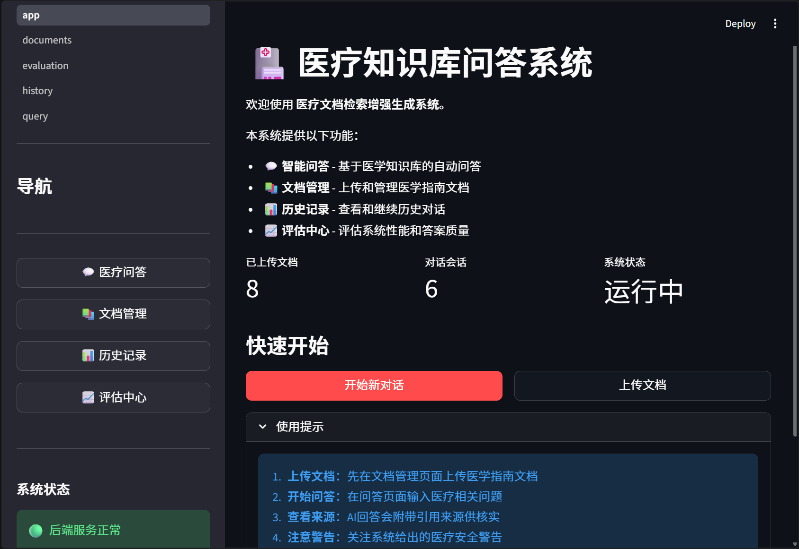
</p>

<h1 align="center">🩺 Medical RAG System</h1>

<p align="center">
  <em>医疗知识库检索增强生成问答系统 — 基于混合检索与置信度评估的智能医疗问答</em>
</p>

<p align="center">
  <a href="https://github.com/GaussAA/Medical-RAG-System/blob/main/LICENSE">
    
  </a>
  <a href="https://www.python.org/">
    
  </a>
  <a href="https://fastapi.tiangolo.com/">
    
  </a>
  <a href="https://streamlit.io/">
    
  </a>
  <a href="https://qdrant.tech/">
    
  </a>
  <a href="https://www.postgresql.org/">
    
  </a>
</p>

<hr>

## 📋 目录

- [项目简介](#-项目简介)
- [核心特性](#-核心特性)
- [系统架构](#-系统架构)
- [快速开始](#-快速开始)
- [使用指南](#-使用指南)
- [API 文档](#-api-文档)
- [评估体系](#-评估体系)
- [技术栈](#-技术栈)
- [项目结构](#-项目结构)
- [常见问题](#-常见问题)
- [路线图](#-路线图)

---

## 📖 项目简介

**Medical RAG System** 是一个基于 **RAG（Retrieval-Augmented Generation）** 架构的医疗知识库智能问答系统。它允许用户上传医学指南文档，系统自动进行文档解析、分块和向量化存储，当用户提问时通过**混合检索（BM25 + 向量相似度）** 召回相关文档片段，最终由 LLM 生成带引用来源的可信回答。

> ⚕️ **核心价值**：将权威医学指南（如临床诊疗指南、专家共识、用药规范）转化为可交互的智能问答知识库，辅助医疗从业者快速获取循证信息。

---

## ✨ 核心特性

### 📄 知识库管理

| 特性                  | 说明                                            |
| --------------------- | ----------------------------------------------- |
| **Markdown 文档上传** | 支持 `.md` / `.markdown` 格式医学指南文档       |
| **批量上传**          | 单批次最多 50 个文件，统一向量化，MD5 去重      |
| **层级感知分块**      | 按 H1-H6 标题边界智能切分，保留标题树和内容类型 |
| **三存储同步**        | PostgreSQL + Qdrant（向量）+ BM25 索引同步管理  |

<p align="center">
  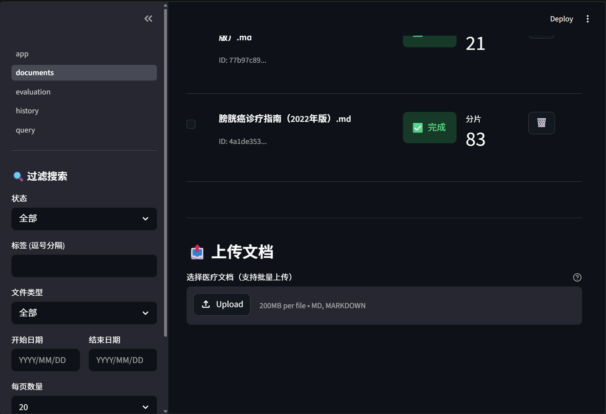
  <br>
  <em>知识库文档上传与管理界面</em>
</p>

<p align="center">
  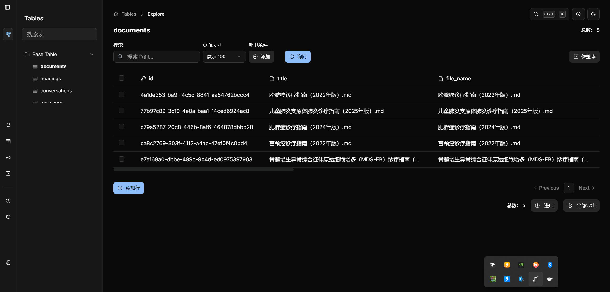
  <br>
  <em>已上传文档的存储管理</em>
</p>

<p align="center">
  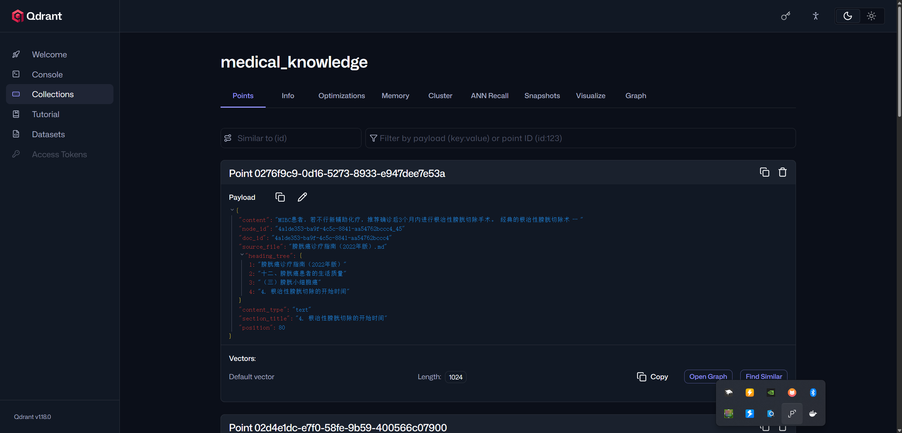
  <br>
  <em>文档片段向量化存储状态</em>
</p>

### 🔍 智能检索

| 特性               | 说明                                                     |
| ------------------ | -------------------------------------------------------- |
| **混合检索**       | BM25 全文检索 + 向量语义检索，RRF 融合排序               |
| **查询类型检测**   | 自动识别查询意图（药物、诊断、表格等），动态调整检索权重 |
| **交叉编码重排序** | BAAI/bge-reranker-v2-m3 对候选片段精确重排序             |
| **GPU 常驻加速**   | Embedding + Reranker 以 FP16 精度常驻 GPU，检索响应 < 5s |

### 💬 智能问答

| 特性           | 说明                                           |
| -------------- | ---------------------------------------------- |
| **流式输出**   | SSE 流式响应，实时显示生成过程                 |
| **多轮对话**   | 基于 session 的上下文管理，支持连续追问        |
| **置信度评估** | 多维度的答案置信度评分（高/中/低/不可靠）      |
| **引用溯源**   | 答案中的每个论断均标注来源，点击可跳转原文片段 |
| **风险警示**   | 自动检测用药、诊断、急诊等敏感内容并给出警示   |

<p align="center">
  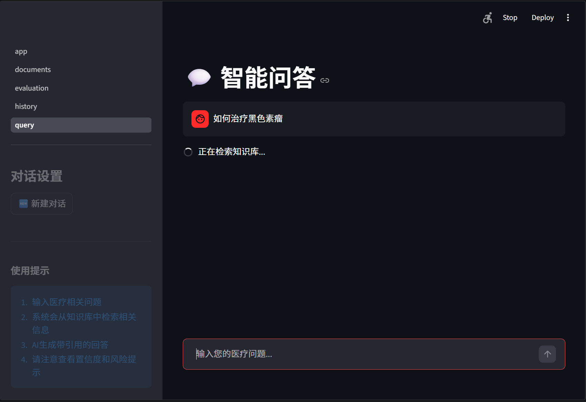
  <br>
  <em>系统正在检索知识库中的相关文档片段</em>
</p>

<p align="center">
  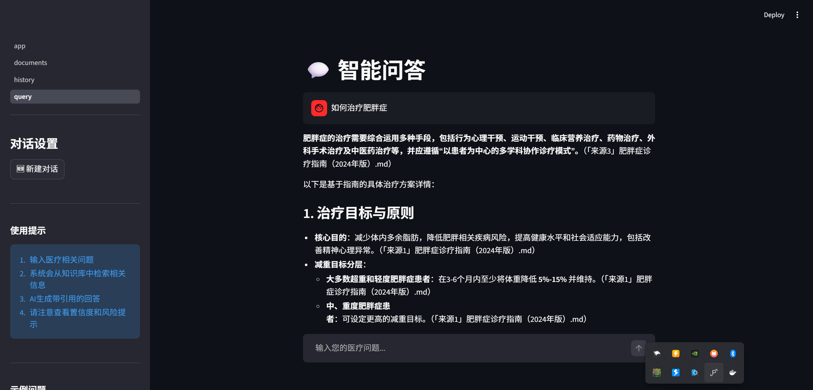
  <br>
  <em>多轮对话问答界面</em>
</p>

### 🛡️ 安全与可信

| 特性             | 说明                                   |
| ---------------- | -------------------------------------- |
| **引用验证**     | 自动验证生成答案的引用是否在检索结果中 |
| **幻觉检测**     | 检测未验证引用比例，超过阈值触发告警   |
| **来源免责声明** | 明确标注 AI 生成内容的局限性           |
| **内容安全审查** | 输入输出双层安全检查                   |

<p align="center">
  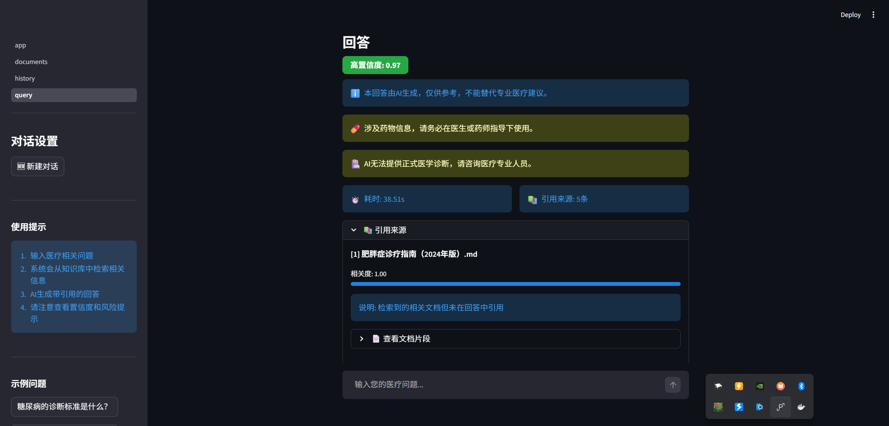
  <br>
  <em>引用来源与免责声明展示</em>
</p>

<p align="center">
  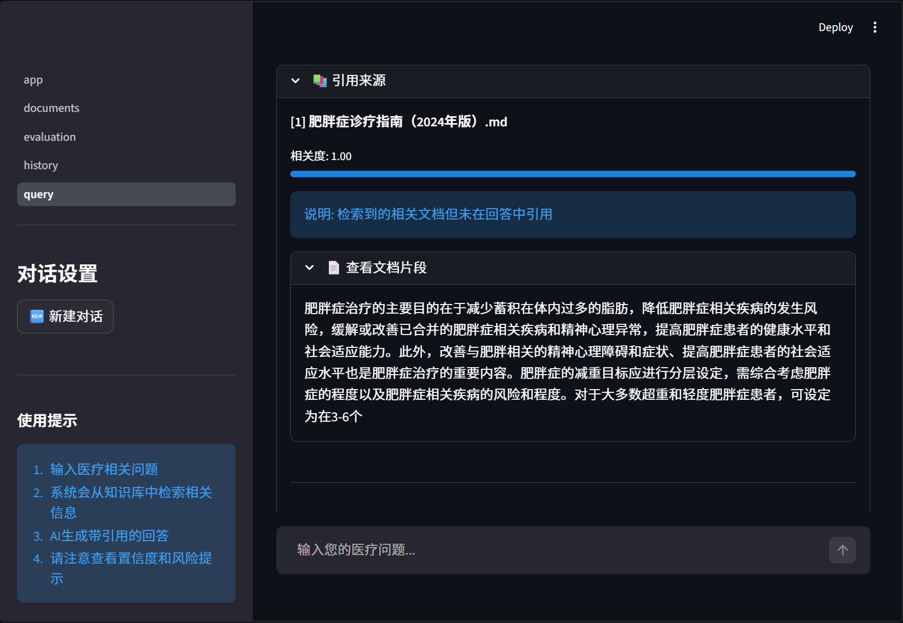
  <br>
  <em>展开查看引用来源详情与文档片段</em>
</p>

### 📊 评估与监控

| 特性                | 说明                                     |
| ------------------- | ---------------------------------------- |
| **检索评估**        | Precision@K / Recall@K / NDCG@K / MRR    |
| **生成评估**        | Faithfulness / Answer Relevancy          |
| **医疗安全评估**    | 实体准确率 / 警告覆盖率                  |
| **Prometheus 监控** | 请求延迟、检索计数、GPU 状态、Token 统计 |

<p align="center">
  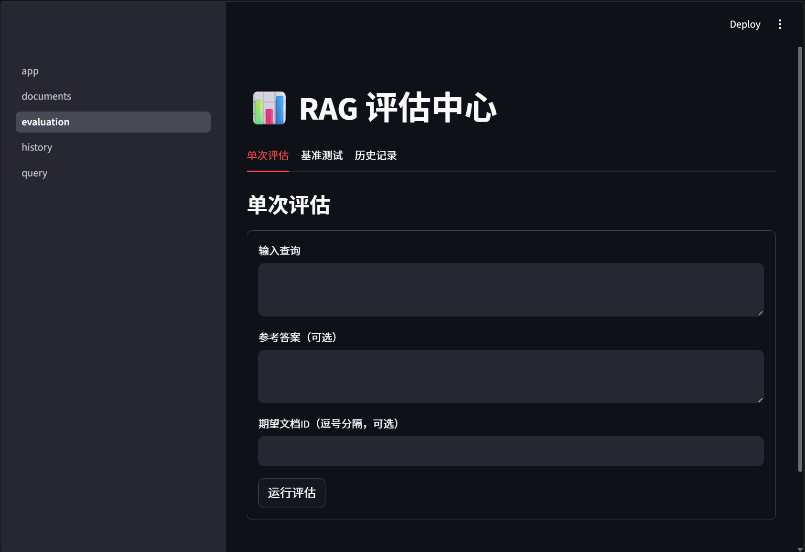
  <br>
  <em>RAG 系统全面评估面板</em>
</p>

<p align="center">
  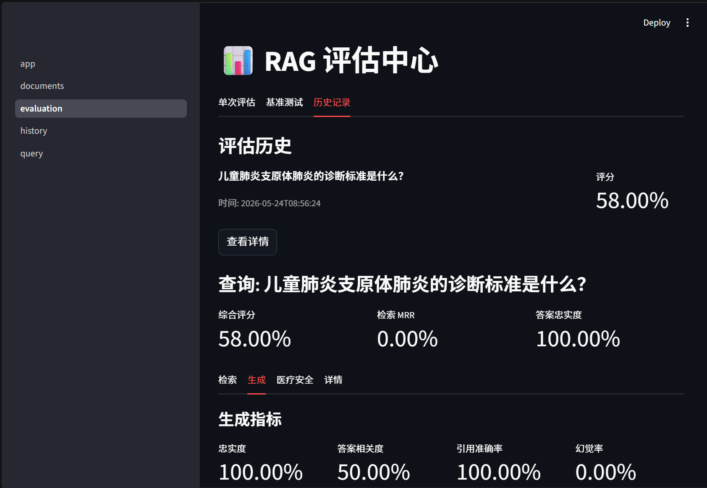
  <br>
  <em>单次查询评估结果详细说明</em>
</p>

---

## 🏗️ 系统架构

### 整体架构

```
┌──────────────┐    ┌──────────────────────────────────────┐    ┌───────────┐
│              │    │            RAG Engine                 │    │           │
│  Streamlit   │◄──►│                                      │◄──►│   LLM     │
│   Frontend   │    │  ┌──────┐  ┌───────┐  ┌──────────┐  │    │  (Ollama  │
│              │    │  │Hybrid│─►│Cross  │─►│  Prompt  │  │    │  /API)   │
│              │    │  │Retr. │  │Encod. │  │ Builder  │  │    │           │
└──────────────┘    │  └──────┘  └───────┘  └──────────┘  │    └───────────┘
                    │                                      │
                    │  ┌─────────────────────────────────┐  │
                    │  │    Risk Warning / Citation       │  │
                    │  │    Verification / Conf. Eval     │  │
                    │  └─────────────────────────────────┘  │
                    └──────────────────────────────────────┘
                              │
         ┌────────────────────┼────────────────────┐
         ▼                    ▼                    ▼
   ┌──────────┐       ┌───────────┐        ┌──────────┐
   │Qdrant    │       │PostgreSQL│        │  BM25   │
   │(Vector)  │       │(Metadata)│        │ (Whoosh)│
   └──────────┘       └───────────┘        └──────────┘
```

### 核心流程

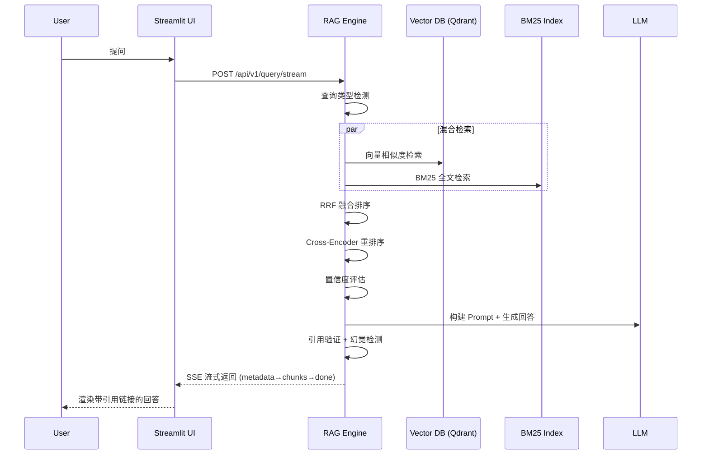

> 📖 **详细架构文档**: [docs/detail-design/01-architecture-overview.md](docs/detail-design/01-architecture-overview.md)

---

## 🚀 快速开始

### 前置条件

| 依赖          | 版本要求   | 说明                    |
| ------------- | ---------- | ----------------------- |
| Python        | ≥ 3.11     | 运行环境                |
| PostgreSQL    | ≥ 16       | 文档元数据与对话存储    |
| Qdrant        | ≥ 1.13     | 向量数据库              |
| GPU (可选)    | ≥ 4GB 显存 | 加速模型推理，FP16 常驻 |
| Ollama (可选) | latest     | 本地 LLM 推理           |

### 环境准备

```bash
# 1. 克隆项目
git clone https://github.com/GaussAA/Medical-RAG-System.git
cd Medical-RAG-System

# 2. 安装依赖
uv sync

# 3. 配置环境变量
cp .env.example .env
# 编辑 .env 文件，填写数据库连接等配置（根据Docker配置）

# 4. 启动 PostgreSQL 和 Qdrant
# 使用 Docker Compose 一键启动
docker compose up -d

# 5. 初始化数据库
uv run python scripts/init_db.py            # PostgreSQL 建表
uv run python scripts/init_vector_db.py      # Qdrant 创建集合
```

### 启动服务

```bash
# 终端 1：启动 FastAPI 后端
uv run uvicorn app.main:app --reload

# 终端 2：启动 Streamlit 前端
uv run streamlit run streamlit_app/app.py
```

启动后访问:

- **Web UI**: [http://localhost:8501](http://localhost:8501)
- **API 文档**: [http://localhost:8000/docs](http://localhost:8000/docs)
- **Metrics**: [http://localhost:8000/metrics](http://localhost:8000/metrics)

---

## 🎯 使用指南

### 1. 上传医学文档

支持上传 Markdown 格式的医学指南文档，系统自动完成解析、分块和向量化。

```bash
curl -X POST "http://localhost:8000/api/v1/documents/upload" \
  -F "file=@临床诊疗指南_糖尿病.md"
```

### 2. 提问

```bash
curl -X POST "http://localhost:8000/api/v1/query/stream" \
  -H "Content-Type: application/json" \
  -d '{"question": "糖尿病的诊断标准是什么？"}'
```

### 3. 多轮对话

首次查询自动创建 session，后续请求携带 `session_id` 即可延续对话上下文。

```bash
# 首次查询（自动创建 session）
curl -X POST "http://localhost:8000/api/v1/query" \
  -H "Content-Type: application/json" \
  -d '{"question": "高血压患者应如何饮食？"}'

# 后续追问（携带 session_id）
curl -X POST "http://localhost:8000/api/v1/query" \
  -H "Content-Type: application/json" \
  -d '{
    "question": "降压药有哪些注意事项？",
    "session_id": "550e8400-e29b-41d4-a716-446655440000"
  }'
```

---

## 📡 API 文档

| 端点                             | 方法   | 说明                     |
| -------------------------------- | ------ | ------------------------ |
| `/api/v1/query`                  | POST   | 同步查询                 |
| `/api/v1/query/stream`           | POST   | 流式查询（SSE）          |
| `/api/v1/documents/upload`       | POST   | 单文档上传               |
| `/api/v1/documents/upload/batch` | POST   | 批量上传（最多 50 文件） |
| `/api/v1/documents`              | GET    | 文档列表                 |
| `/api/v1/documents/{id}`         | DELETE | 删除文档                 |
| `/api/v1/sessions`               | GET    | 会话列表                 |
| `/api/v1/sessions/{id}/messages` | GET    | 会话消息历史             |
| `/api/v1/sessions/{id}`          | DELETE | 删除会话                 |
| `/api/v1/evaluate`               | POST   | 单次评估                 |
| `/api/v1/evaluate/benchmark`     | POST   | 批量基准测试             |
| `/metrics`                       | GET    | Prometheus 监控指标      |

> 完整 API 文档请参考: [docs/detail-design/](docs/detail-design/)

---

## 📊 评估体系

系统提供三种维度的评估能力，确保问答质量：

### 🔎 检索评估

| 指标            | 说明                             |
| --------------- | -------------------------------- |
| **Precision@K** | 前 K 个结果中相关文档的比例      |
| **Recall@K**    | 前 K 个结果召回的相关文档覆盖率  |
| **NDCG@K**      | 归一化折损累计增益，衡量排序质量 |
| **MRR**         | 第一个相关结果的倒数排名         |

### 💬 生成评估

| 指标                 | 说明                           |
| -------------------- | ------------------------------ |
| **Faithfulness**     | 生成答案是否忠实于检索到的文档 |
| **Answer Relevancy** | 答案是否回答了用户问题         |

### 🏥 医疗安全评估

| 指标           | 说明                       |
| -------------- | -------------------------- |
| **实体准确率** | 医疗专业术语的准确使用     |
| **警告覆盖率** | 系统对敏感内容的警告覆盖率 |

```bash
# 运行评估
uv run python scripts/run_evaluation.py

# 运行单元测试
uv run pytest tests/unit/ -v
```

> 📖 **评估系统文档**: [docs/detail-design/11-evaluation-system.md](docs/detail-design/11-evaluation-system.md)

---

## 🛠️ 技术栈

| 类别               | 技术                                                                      | 用途                      |
| ------------------ | ------------------------------------------------------------------------- | ------------------------- |
| **后端框架**       | [FastAPI](https://fastapi.tiangolo.com/)                                  | RESTful API 服务          |
| **前端 UI**        | [Streamlit](https://streamlit.io/)                                        | 交互式 Web 界面           |
| **向量数据库**     | [Qdrant](https://qdrant.tech/)                                            | 向量相似度检索            |
| **全文检索引擎**   | [Whoosh](https://whoosh.readthedocs.io/)                                  | BM25 全文检索             |
| **关系数据库**     | [PostgreSQL](https://www.postgresql.org/)                                 | 文档元数据、对话管理      |
| **Embedding 模型** | [BAAI/bge-m3](https://huggingface.co/BAAI/bge-m3)                         | 文本向量化（FP16, 1024d） |
| **Reranker 模型**  | [BAAI/bge-reranker-v2-m3](https://huggingface.co/BAAI/bge-reranker-v2-m3) | 交叉编码重排序（FP16）    |
| **LLM**            | [Ollama](https://ollama.com/) / API                                       | 答案生成                  |
| **ORM**            | SQLAlchemy 2.0                                                            | 异步数据库操作            |
| **监控**           | Prometheus Client                                                         | 性能指标采集              |
| **包管理**         | [uv](https://github.com/astral-sh/uv)                                     | Python 依赖管理           |

---

## 📁 项目结构

```
Medical-RAG-System/
├── app/                          # FastAPI 后端
│   ├── api/routes/               # API 路由层
│   │   ├── query.py              #   查询 API
│   │   ├── documents.py          #   文档上传/管理 API
│   │   ├── sessions.py           #   会话管理 API
│   │   ├── evaluate.py           #   评估 API
│   │   └── metrics.py            #   监控指标 API
│   ├── core/                     # 核心业务逻辑
│   │   ├── rag_engine.py         #   RAG 查询编排入口
│   │   ├── confidence.py         #   置信度评估
│   │   ├── safety.py             #   安全检查
│   │   ├── risk_warnings.py      #   风险警告生成
│   │   └── metrics.py            #   Prometheus 指标
│   ├── models/                   # 数据模型
│   │   ├── database.py           #   数据库连接管理
│   │   ├── schemas.py            #   Pydantic 请求/响应模型
│   │   └── models.py             #   SQLAlchemy ORM 模型
│   └── services/                 # 服务层
│       ├── document_service.py   #   文档处理服务
│       ├── session.py            #   会话管理服务
│       └── consistency.py        #   数据一致性检查
│
├── rag/                          # RAG 核心组件
│   ├── parser/                   # 文档解析
│   │   └── markdown_parser.py    #   Markdown 解析器
│   ├── chunking/                 # 分块策略
│   │   └── hierarchical_chunker.py  # 层级感知分块器
│   ├── retrieval/                # 检索器
│   │   ├── hybrid_retriever.py   #   混合检索 + RRF 融合
│   │   ├── vector_retriever.py   #   向量检索（BGE-M3）
│   │   └── bm25_retriever.py     #   BM25 全文检索（Whoosh）
│   ├── reranker/                 # 重排序
│   │   └── cross_encoder.py      #   Cross-Encoder 重排序
│   ├── generation/               # LLM 生成
│   │   ├── llm_generator.py      #   LLM 调用封装
│   │   └── prompt.py             #   Prompt 模板
│   └── evaluation/               # 评估系统
│       ├── evaluator.py          #   评估器入口
│       ├── retrieval_eval.py     #   检索评估
│       ├── generation_eval.py    #   生成评估
│       └── safety_eval.py        #   医疗安全评估
│
├── streamlit_app/                # Streamlit 前端
│   ├── app.py                    #   应用入口
│   ├── components/               # UI 组件
│   │   └── chat.py               #   聊天界面组件
│   ├── pages/                    # 页面
│   │   ├── query.py              #   问答页面
│   │   ├── document_manager.py   #   文档管理页面
│   │   └── evaluation.py         #   评估页面
│   └── utils/                    # 工具函数
│       └── api_client.py         #   API 客户端
│
├── config/                       # 配置
│   ├── config.yaml               #   YAML 应用配置
│   └── settings.py               #   Pydantic 配置模型
│
├── scripts/                      # 工具脚本
│   ├── init_db.py                #   初始化 PostgreSQL
│   └── init_vector_db.py         #   初始化 Qdrant
│
├── tests/                        # 测试
│   ├── unit/                     #   单元测试
│   └── integration/              #   集成测试
│
├── docs/                         # 详细设计文档
│   └── detail-design/            #   架构决策记录
│       ├── 01-architecture-overview.md
│       ├── 02-rag-pipeline.md
│       ├── 03-document-processing.md
│       ├── 04-retrieval-system.md
│       ├── 05-session-management.md
│       ├── 06-data-models.md
│       ├── 07-configuration.md
│       ├── 09-query-type-detection.md
│       ├── 10-citation-verification.md
│       └── 11-evaluation-system.md
│
├── public/images/                # 项目展示图片
├── data/                         # 数据目录
│   └── evaluation_dataset.jsonl  #   评估数据集
├── CLAUDE.md                     # AI 辅助开发指南
└── README.md                     # 本文件
```

---

## ❓ 常见问题

<details>
<summary><b>为什么选择 Markdown 作为唯一支持的文档格式？</b></summary>

PDF 和 DOCX 解析存在可靠性问题（表格识别、段落还原），而 Markdown 格式清晰、层级明确，便于实现精确的标题层级感知分块。详见 [03-document-processing.md](docs/detail-design/03-document-processing.md)。

</details>

<details>
<summary><b>两模型常驻 GPU 需要多大显存？</b></summary>

Embedding（BAAI/bge-m3）和 Reranker（BAAI/bge-reranker-v2-m3）均以 FP16 精度加载，合计约 **1.7GB**，可永久常驻 4GB GPU。不再需要 GPU 时间分片。

</details>

<details>
<summary><b>如何评估系统质量？</b></summary>

提供检索评估（Precision/Recall/NDCG/MRR）、生成评估（Faithfulness/Relevancy）和医疗安全评估（实体准确率/警告覆盖率）。评测数据集格式为 JSONL，详见 [11-evaluation-system.md](docs/detail-design/11-evaluation-system.md)。

</details>

<details>
<summary><b>如何清理孤立索引？</b></summary>

如果数据库中的文档与向量索引不一致，可通过 `/cleanup-orphans` 工具修复。详见 [01-architecture-overview.md](docs/detail-design/01-architecture-overview.md)。

</details>

---

## 🗺️ 路线图

- [x] 基础 RAG 问答流程
- [x] 混合检索（BM25 + 向量）
- [x] 交叉编码重排序
- [x] 多轮对话管理
- [x] 置信度评估
- [x] 引用验证与幻觉检测
- [x] 医疗安全风险警告
- [x] RAG 评估系统
- [x] GPU FP16 常驻加速
- [ ] 更多 Embedding 模型支持
- [ ] GraphRAG 知识图谱增强
- [ ] 多轮对话 Agent 工具调用
- [ ] 用户反馈与答案修正流程
- [ ] 文档版本管理与多版本对比

---

## 📄 许可证

[MIT License](LICENSE)

## 🤝 贡献

欢迎通过 Issue 提交反馈，或 Fork 仓库提交 Pull Request。

## 📬 联系方式

项目维护者: [GaussAA](https://github.com/GaussAA)

---

<p align="center">
  <sub>Built with ❤️ for better medical knowledge access</sub>
  <br>
  <sub>⚠️ 本项目为辅助工具，AI 生成的内容仅供参考，不能替代专业医疗意见。</sub>
</p>
