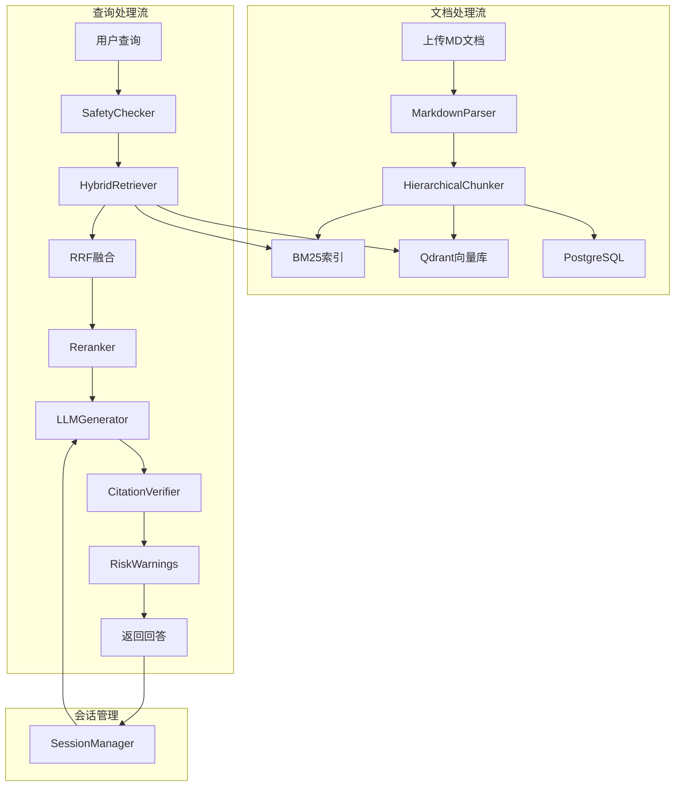
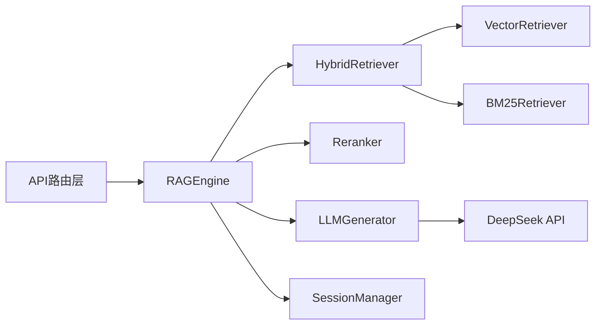

# 医疗知识库RAG问答系统 - 核心贡献代码提取

> 本文档按系统完整流程组织，提取各模块的核心贡献代码，展示从文档上传到查询回答的全链路实现。

---

## 目录

1. [系统架构概述](#1-系统架构概述)
2. [数据模型定义](#2-数据模型定义)
3. [文档上传流程](#3-文档上传流程)
4. [文档解析与分块](#4-文档解析与分块)
5. [批量处理与统一向量化](#5-批量处理与统一向量化)
6. [混合检索与RRF融合](#6-混合检索与rrf融合)
7. [重排序器实现](#7-重排序器实现)
8. [LLM生成与引用验证](#8-llm生成与引用验证)
9. [RAG引擎编排](#9-rag引擎编排)
10. [会话管理与上下文注入](#10-会话管理与上下文注入)
11. [GPU内存管理](#11-gpu内存管理)
12. [三存储同步策略](#12-三存储同步策略)

---

## 1. 系统架构概述

### 1.1 完整数据流



### 1.2 核心模块依赖关系



---

## 2. 数据模型定义

**文件**: `app/models/database.py`

### 2.1 核心实体模型

```python
import uuid
from datetime import datetime, UTC
from sqlalchemy import JSON, Boolean, BigInteger, DateTime, Float, ForeignKey, Integer, String, Text
from sqlalchemy.dialects.postgresql import UUID, ARRAY
from sqlalchemy.orm import DeclarativeBase, Mapped, mapped_column, relationship

def _utc_now():
    return datetime.now(UTC)

class Base(DeclarativeBase):
    pass

# 文档表 - 存储文档元数据和状态
class Document(Base):
    __tablename__ = "documents"

    id: Mapped[uuid.UUID] = mapped_column(UUID(as_uuid=True), primary_key=True, default=uuid.uuid4)
    title: Mapped[str] = mapped_column(String(500), nullable=False)
    file_name: Mapped[str] = mapped_column(String(255), nullable=False)
    file_path: Mapped[str] = mapped_column(String(1000), nullable=False)
    file_type: Mapped[str] = mapped_column(String(50), nullable=False)
    file_md5: Mapped[str | None] = mapped_column(String(32), nullable=True, index=True)
    status: Mapped[str] = mapped_column(String(50), default="pending")
    total_chunks: Mapped[int | None] = mapped_column(Integer, nullable=True)
    created_at: Mapped[datetime] = mapped_column(DateTime(timezone=True), default=_utc_now)
    updated_at: Mapped[datetime] = mapped_column(
        DateTime(timezone=True), default=_utc_now, onupdate=_utc_now
    )
    tags: Mapped[list[str]] = mapped_column(ARRAY(String), default=lambda: [])

    # 关系：一个文档对应多个Chunk和Heading
    chunks: Mapped[list["Chunk"]] = relationship(
        "Chunk", back_populates="document", cascade="all, delete-orphan"
    )
    headings: Mapped[list["Heading"]] = relationship(
        "Heading", back_populates="document", cascade="all, delete-orphan"
    )

# 分块表 - 存储文档分块及向量ID
class Chunk(Base):
    __tablename__ = "chunks"

    id: Mapped[uuid.UUID] = mapped_column(UUID(as_uuid=True), primary_key=True, default=uuid.uuid4)
    doc_id: Mapped[uuid.UUID] = mapped_column(
        UUID(as_uuid=True), ForeignKey("documents.id", ondelete="CASCADE"), nullable=False
    )
    heading_id: Mapped[uuid.UUID | None] = mapped_column(
        UUID(as_uuid=True), ForeignKey("headings.id", ondelete="SET NULL"), nullable=True
    )
    content: Mapped[str] = mapped_column(Text, nullable=False)
    char_count: Mapped[int | None] = mapped_column(Integer, nullable=True)
    position: Mapped[int | None] = mapped_column(Integer, nullable=True)
    content_type: Mapped[str | None] = mapped_column(String(20), nullable=True)  # text/table/list
    section_title: Mapped[str | None] = mapped_column(String(500), nullable=True)
    vector_id: Mapped[str | None] = mapped_column(String(255), nullable=True)

    document: Mapped["Document"] = relationship("Document", back_populates="chunks")
    heading: Mapped["Heading | None"] = relationship("Heading", back_populates="chunks")

# 标题表 - 存储文档层级结构
class Heading(Base):
    __tablename__ = "headings"

    id: Mapped[uuid.UUID] = mapped_column(UUID(as_uuid=True), primary_key=True, default=uuid.uuid4)
    doc_id: Mapped[uuid.UUID] = mapped_column(
        UUID(as_uuid=True), ForeignKey("documents.id", ondelete="CASCADE"), nullable=False
    )
    parent_id: Mapped[uuid.UUID | None] = mapped_column(
        UUID(as_uuid=True), ForeignKey("headings.id", ondelete="CASCADE"), nullable=True
    )
    level: Mapped[int] = mapped_column(Integer, nullable=False)  # H1-H6
    title: Mapped[str] = mapped_column(String(500), nullable=False)
    position: Mapped[int] = mapped_column(Integer, nullable=False)

    # 自引用关系：父子标题
    parent: Mapped["Heading | None"] = relationship("Heading", remote_side=[id], back_populates="children")
    children: Mapped[list["Heading"]] = relationship("Heading", back_populates="parent", cascade="all, delete-orphan")
    chunks: Mapped[list["Chunk"]] = relationship("Chunk", back_populates="heading")

# 会话表 - 存储多轮对话会话
class Conversation(Base):
    __tablename__ = "conversations"

    id: Mapped[uuid.UUID] = mapped_column(UUID(as_uuid=True), primary_key=True, default=uuid.uuid4)
    session_title: Mapped[str | None] = mapped_column(String(255), nullable=True)
    message_count: Mapped[int] = mapped_column(Integer, default=0)
    is_active: Mapped[bool] = mapped_column(Boolean, default=True)
    created_at: Mapped[datetime] = mapped_column(DateTime(timezone=True), default=_utc_now)
    updated_at: Mapped[datetime] = mapped_column(
        DateTime(timezone=True), default=_utc_now, onupdate=_utc_now
    )

    messages: Mapped[list["Message"]] = relationship(
        "Message", back_populates="conversation", cascade="all, delete-orphan"
    )

# 消息表 - 存储会话中的单条消息
class Message(Base):
    __tablename__ = "messages"

    id: Mapped[uuid.UUID] = mapped_column(UUID(as_uuid=True), primary_key=True, default=uuid.uuid4)
    session_id: Mapped[uuid.UUID] = mapped_column(
        UUID(as_uuid=True), ForeignKey("conversations.id", ondelete="CASCADE"), nullable=False
    )
    role: Mapped[str] = mapped_column(String(20), nullable=False)  # user/assistant
    content: Mapped[str] = mapped_column(Text, nullable=False)
    confidence: Mapped[float | None] = mapped_column(Float, nullable=True)
    citations: Mapped[list[dict] | None] = mapped_column(JSON, nullable=True)
    warnings: Mapped[list[dict] | None] = mapped_column(JSON, nullable=True)
    created_at: Mapped[datetime] = mapped_column(DateTime(timezone=True), default=_utc_now)

    conversation: Mapped["Conversation"] = relationship("Conversation", back_populates="messages")
```

### 2.2 Pydantic Schema定义

**文件**: `app/models/schemas.py` (关键部分)

```python
from pydantic import BaseModel, Field
from typing import Any

class RetrievedNode(BaseModel):
    """检索结果节点"""
    node_id: str
    content: str
    score: float = 0.0
    metadata: dict[str, Any] = Field(default_factory=dict)

class RerankedNode(BaseModel):
    """重排序后的节点"""
    node_id: str
    content: str = ""
    score: float = 0.0
    metadata: dict[str, Any] = Field(default_factory=dict)

class QueryRequest(BaseModel):
    """查询请求"""
    question: str = Field(..., max_length=2000)
    session_id: str | None = None
    filters: dict[str, Any] | None = None
    top_k: int | None = None
    top_n: int | None = None

class QueryResponse(BaseModel):
    """查询响应"""
    answer: str
    confidence: float = 0.0
    citations: list[dict] = Field(default_factory=list)
    warnings: list[dict] = Field(default_factory=list)
    session_id: str = ""
    processing_time: float = 0.0
    metadata: dict[str, Any] = Field(default_factory=dict)
    trace_id: str | None = None

class ChunkMetadata(BaseModel):
    """分块元数据"""
    source_file: str = ""
    section_title: str | None = None
    heading_tree: dict[int, str] = Field(default_factory=dict)
    content_type: str = "text"  # text/table/list
    char_count: int | None = None
    position: int | None = None
    heading_level: int | None = None

class Chunk(BaseModel):
    """分块对象"""
    chunk_id: str = ""
    doc_id: str = ""
    content: str
    token_count: int | None = None
    metadata: ChunkMetadata | dict = Field(default_factory=dict)
```

---

## 3. 文档上传流程

**文件**: `app/api/routes/documents.py`

### 3.1 单文档上传

```python
@router.post("/upload", response_model=DocumentUploadResponse)
async def upload_document(
    request: Request,
    file: UploadFile = File(...),
    title: str | None = None,
) -> DocumentUploadResponse:
    """上传单个Markdown文档"""
    document_service = request.app.state.document_service

    # 1. 文件类型验证（仅支持Markdown）
    allowed_types = [".md", ".markdown"]
    original_filename = file.filename or "Untitled"
    file_ext = Path(original_filename).suffix.lower()

    if file_ext not in allowed_types:
        raise HTTPException(status_code=400, detail=f"Unsupported file type: {file_ext}")

    # 2. 文件名安全处理
    safe_filename = re.sub(r'[<>:"/\\|?*]', "_", original_filename)

    # 3. MD5去重检测
    raw_file_path = Path(f"data/raw_documents/{safe_filename}")
    if raw_file_path.exists():
        raise HTTPException(status_code=409, detail=f"Document '{original_filename}' already exists")

    # 4. 生成文档ID并保存文件
    doc_id = str(uuid.uuid4())
    doc_title = title or original_filename

    raw_file_path.parent.mkdir(parents=True, exist_ok=True)
    content = await file.read()
    with open(raw_file_path, "wb") as f:
        f.write(content)

    # 5. 初始化PostgreSQL记录
    await document_service.init_document(doc_id, str(raw_file_path), doc_title)

    # 6. 启动后台处理任务（非阻塞）
    asyncio.create_task(process_document_background(doc_id, str(raw_file_path), title=doc_title))

    return DocumentUploadResponse(
        document_id=doc_id,
        title=doc_title,
        file_name=original_filename,
        file_type=file_ext[1:],
        status="processing",
        message="Document uploaded successfully, processing in background...",
    )
```

### 3.2 后台文档处理

```python
async def process_document_background(doc_id: str, file_path: str, title: str | None = None):
    """后台处理文档（使用独立的DocumentService实例）"""
    from app.services.document import DocumentService
    from app.core.database import get_session_factory

    factory = get_session_factory()
    async_session = factory()
    document_service = DocumentService(async_session=async_session)

    try:
        logger.info(f"Starting to process document {doc_id}")
        await document_service.process_document(file_path, title=title, doc_id=doc_id)
        logger.info(f"Document {doc_id} processed successfully")
    except Exception as e:
        logger.error(f"Error processing document {doc_id}: {e}")
    finally:
        if async_session is not None:
            await async_session.close()
```

---

## 4. 文档解析与分块

### 4.1 Markdown解析器

**文件**: `rag/parser/markdown_parser.py`

```python
class MarkdownParser(BaseParser):
    supported_extensions = [".md", ".markdown"]

    HEADING_RE = re.compile(r"^(#{1,6})\s+(.+)$")
    TABLE_CAPTION_RE = re.compile(r"^\*\*(表[一二三四五六七八九十\d]+[^\*]*)\*\*$")

    async def parse_with_headings(self, file_path: str | Path) -> tuple[ParsedDocument, list[dict[str, Any]]]:
        """
        解析Markdown文件并提取标题树结构
        返回: (ParsedDocument, heading_tree_list)
        """
        file_path = Path(file_path)
        with open(file_path, "r", encoding="utf-8") as f:
            lines = f.readlines()

        # 构建标题树
        root_headings = []
        heading_stack: list[HeadingNode] = []

        for line_num, line in enumerate(lines, start=1):
            match = self.HEADING_RE.match(line.strip())
            if match:
                level = len(match.group(1))
                title = match.group(2).strip()
                node = HeadingNode(level=level, title=title, line_number=line_num)

                # 查找父节点（最近的低层级标题）
                while heading_stack and heading_stack[-1].level >= level:
                    heading_stack.pop()

                if heading_stack:
                    node.parent = heading_stack[-1]
                    node.parent.children.append(node)
                else:
                    root_headings.append(node)

                heading_stack.append(node)

        # 展平标题树，添加位置信息（用于数据库存储）
        heading_tree_list = []
        position = 0

        def flatten_tree(nodes: list[HeadingNode], parent_position: int | None = None):
            nonlocal position
            for node in nodes:
                heading_info = {
                    "level": node.level,
                    "title": node.title,
                    "position": position,
                    "parent_position": parent_position,
                    "line_number": node.line_number,
                }
                heading_tree_list.append(heading_info)
                current_position = position
                position += 1
                flatten_tree(node.children, parent_position=current_position)

        flatten_tree(root_headings)

        # 提取表格和文本内容
        tables = self._extract_tables_with_captions(lines)
        content = "".join(lines)

        parsed_doc = ParsedDocument(
            doc_id=str(uuid.uuid4()),
            title=file_path.stem,
            source=str(file_path),
            content_type="mixed" if tables else "text",
            text_content=content,
            tables=tables,
            metadata={"original_length": len(content), "line_count": len(lines)},
        )

        return parsed_doc, heading_tree_list

    def _extract_tables_with_captions(self, lines: list[str]) -> list[TableData]:
        """从Markdown源码中提取带标题的表格"""
        tables = []
        i = 0
        while i < len(lines):
            line = lines[i].strip()
            caption_match = self.TABLE_CAPTION_RE.match(line)
            if caption_match:
                caption = caption_match.group(1)
                table_lines = [lines[i]]
                i += 1
                # 收集表格行
                while i < len(lines) and lines[i].strip() and (
                    lines[i].strip().startswith("|") or lines[i].strip().startswith("-")
                ):
                    table_lines.append(lines[i])
                    i += 1
                table_text = "".join(table_lines)
                table_data = self._parse_markdown_table(table_text, caption)
                if table_data:
                    tables.append(table_data)
                continue
            i += 1
        return tables
```

### 4.2 层级分块器

**文件**: `rag/chunking/hierarchical_chunker.py`

```python
class HierarchicalChunker(BaseChunker):
    """
    层级感知分块器 - 按Markdown标题边界切分

    策略:
    1. 按H1-H6标题切分，保留语义单元
    2. 表格和列表作为独立chunk
    3. 为每块附加完整heading_tree上下文
    """

    def __init__(self):
        settings = get_settings()
        self.config = settings.rag.chunking
        self.chunk_size = self.config.chunk_size  # 512
        self.chunk_overlap = self.config.chunk_overlap  # 50
        self.max_chunk_length = self.config.max_chunk_length  # 1000

    def chunk(self, text: str, metadata: dict | None = None) -> list[Chunk]:
        """执行层级分块"""
        if not text.strip():
            return []

        metadata = metadata or {}
        heading_tree = metadata.get("heading_tree", {})
        tables = metadata.get("tables", [])

        # 按标题切分文档
        sections = self._split_by_headings(text)
        chunks = []
        position = 0

        for section in sections:
            heading_info = section.get("heading", {})
            content = section.get("content", "")
            heading_level = heading_info.get("level", 0)
            heading_title = heading_info.get("title", "")

            if not content.strip():
                continue

            # 构建当前section的heading tree上下文
            section_heading_tree = self._build_section_heading_tree(
                heading_tree, heading_level, heading_title
            )

            # 检测内容类型
            content_type = self._detect_content_type(content, tables)

            # 判断是否需要进一步切分
            if len(content) <= self.max_chunk_length:
                # 内容较短，直接作为单个chunk
                chunk_metadata = ChunkMetadata(
                    source_file=metadata.get("source_file", ""),
                    section_title=heading_title,
                    heading_tree=section_heading_tree,
                    content_type=content_type,
                    char_count=len(content),
                    position=position,
                    heading_level=heading_level,
                )
                chunks.append(
                    Chunk(
                        chunk_id=str(uuid.uuid4()),
                        doc_id=metadata.get("doc_id", ""),
                        content=content.strip(),
                        token_count=self.count_tokens(content),
                        metadata=chunk_metadata,
                    )
                )
                position += 1
            else:
                # 内容较长，需要按语义边界切分
                sub_chunks = self._split_large_content(
                    content, section_heading_tree, heading_title,
                    heading_level, tables, metadata.get("source_file", ""), position
                )
                chunks.extend(sub_chunks)
                position += len(sub_chunks)

        # 合并过小的chunks
        chunks = self._merge_small_chunks(chunks)
        return chunks

    def _split_by_headings(self, text: str) -> list[dict]:
        """按Markdown标题切分文本"""
        lines = text.split("\n")
        sections = []
        current_heading = None
        current_content_lines = []
        current_start_line = 0

        for line_num, line in enumerate(lines, start=1):
            match = re.match(r"^(#{1,6})\s+(.+)$", line.strip())
            if match:
                # 保存前一个section
                if current_heading is not None:
                    content = "\n".join(current_content_lines)
                    if content.strip():
                        sections.append({
                            "heading": current_heading,
                            "content": content,
                            "start_line": current_start_line,
                        })
                    current_content_lines = []

                # 开始新section（标题行不包含在正文中）
                level = len(match.group(1))
                title = match.group(2).strip()
                current_heading = {"level": level, "title": title}
                current_start_line = line_num + 1
            elif current_heading is not None:
                current_content_lines.append(line)

        # 最后一个section
        if current_content_lines:
            content = "\n".join(current_content_lines)
            if content.strip():
                sections.append({
                    "heading": current_heading or {"level": 0, "title": ""},
                    "content": content,
                    "start_line": current_start_line,
                })

        # 如果没有检测到标题，作为纯文本处理
        if not sections and text.strip():
            sections.append({
                "heading": {"level": 0, "title": ""},
                "content": text.strip(),
                "start_line": 1,
            })

        return sections

    def _detect_content_type(self, content: str, tables: list[dict]) -> str:
        """检测内容类型（text/table/list）"""
        stripped = content.strip()

        # 检测表格
        if stripped.startswith("|") or "|--" in stripped:
            return "table"

        # 检测列表
        lines = stripped.split("\n")
        list_lines = 0
        for line in lines:
            if re.match(r"^[·\-\*]\s+", line.strip()) or re.match(r"^（[0-9]+）", line.strip()):
                list_lines += 1

        if list_lines > len(lines) * 0.3:
            return "list"

        return "text"
```

---

## 5. 批量处理与统一向量化

**文件**: `app/api/routes/documents.py`

### 5.1 批量上传核心逻辑

```python
MAX_BATCH_SIZE = 50

@router.post("/upload/batch", response_model=BatchUploadResponse)
async def upload_documents_batch(
    request: Request,
    files: list[UploadFile] = File(...),
) -> BatchUploadResponse:
    """批量上传文档（最多50个）"""
    if len(files) > MAX_BATCH_SIZE:
        raise HTTPException(status_code=400, detail=f"Maximum {MAX_BATCH_SIZE} files per batch")

    batch_id = str(uuid.uuid4())
    file_infos: list[dict] = []
    succeeded = 0

    # 预处理所有文件：验证、保存、初始化数据库记录
    for file in files:
        original_filename = file.filename or "Untitled"
        file_ext = Path(original_filename).suffix.lower()

        if file_ext not in [".md", ".markdown"]:
            continue  # 跳过不支持的文件

        doc_id = str(uuid.uuid4())
        safe_filename = re.sub(r'[<>:"/\\|?*]', "_", original_filename)
        raw_file_path = Path(f"data/raw_documents/{safe_filename}")

        # 保存文件并初始化数据库记录
        content = await file.read()
        with open(raw_file_path, "wb") as f:
            f.write(content)
        await document_service.init_document(doc_id, str(raw_file_path), original_filename)

        file_infos.append({
            "doc_id": doc_id,
            "file_path": str(raw_file_path),
            "title": original_filename,
        })
        succeeded += 1

    # 初始化批量状态
    request.app.state.batch_upload_status[batch_id] = BatchUploadStatus(
        batch_id=batch_id,
        total=len(files),
        processing=succeeded,
        completed=0,
        failed=0,
        duplicate=0,
        items=items,
    )

    # 启动批量处理任务（统一向量化）
    asyncio.create_task(process_batch_documents_background(
        batch_id, file_infos, request.app.state
    ))

    return BatchUploadResponse(batch_id=batch_id, total=len(files), succeeded=succeeded, ...)
```

### 5.2 统一向量化（核心贡献）

```python
async def process_batch_documents_background(
    batch_id: str,
    file_infos: list[dict],
    app_state_ref,
):
    """
    批量处理文档 - 统一向量化，只加载一次embedding模型
    这是系统的核心优化之一
    """
    from app.core.rag_engine import RAGEngine
    processor = DocumentProcessor()
    rag_engine = RAGEngine()

    # Step 1: 解析所有文档并收集chunks（可并行）
    all_nodes = []
    doc_chunks_map: dict[str, tuple[list, list[dict], list]] = {}

    for file_info in file_infos:
        doc_id = file_info["doc_id"]
        file_path = Path(file_info["file_path"])

        # 解析文档
        parsed_doc, heading_tree = await processor.parse_with_headings(file_path)

        # 构建heading tree dict
        heading_tree_dict = {}
        for h in heading_tree:
            heading_tree_dict[h["level"]] = h["title"]

        # 分块
        chunks = processor.chunk(
            parsed_doc.text_content,
            metadata={
                "doc_id": doc_id,
                "source_file": file_path.name,
                "heading_tree": heading_tree_dict,
                "tables": [t.model_dump() for t in parsed_doc.tables],
            },
        )

        # 创建RetrievedNodes
        retrieved_nodes = processor.create_retrieved_nodes(doc_id, chunks, file_path.name)
        all_nodes.extend(retrieved_nodes)
        doc_chunks_map[doc_id] = (chunks, heading_tree, retrieved_nodes)

    # Step 2: 保存headings到PostgreSQL
    async with factory() as session:
        for doc_id, (chunks, heading_tree, retrieved_nodes) in doc_chunks_map.items():
            for heading_info in heading_tree:
                heading = Heading(
                    id=uuid.uuid4(),
                    doc_id=uuid.UUID(doc_id),
                    level=heading_info["level"],
                    title=heading_info["title"],
                    position=heading_info["position"],
                    parent_id=...,  # 根据parent_position查找
                )
                session.add(heading)
            await session.commit()

    # Step 3: 一次性向量化所有chunks（仅加载一次embedding模型！）
    if all_nodes:
        logger.info(f"[Batch {batch_id}] Vectorizing {len(all_nodes)} chunks in batch")
        success = await rag_engine.process_document(all_nodes)
        if not success:
            logger.warning(f"[Batch {batch_id}] GPU vectorization failed, falling back to CPU")

    # Step 4: 保存chunks到PostgreSQL并更新文档状态
    async with factory() as session:
        for doc_id, (chunks, heading_tree, retrieved_nodes) in doc_chunks_map.items():
            for i, chunk in enumerate(chunks):
                chunk_record = Chunk(
                    id=uuid.UUID(chunk.chunk_id),
                    doc_id=uuid.UUID(doc_id),
                    heading_id=...,  # 根据position查找heading_id
                    content=chunk.content,
                    char_count=chunk.metadata.char_count,
                    position=i,
                    content_type=chunk.metadata.content_type,
                    section_title=chunk.metadata.section_title,
                )
                session.add(chunk_record)

            # 更新文档状态为completed
            doc = await session.get(Document, uuid.UUID(doc_id))
            if doc:
                doc.status = "completed"
                doc.total_chunks = len(chunks)
            await session.commit()
```

### 5.3 Embedding统一向量化实现

**文件**: `app/core/rag_engine.py`

```python
class RAGEngine:
    async def process_document(self, nodes: list[RetrievedNode]) -> bool:
        """
        处理文档向量化 - 核心优化：embedding模型仅加载一次
        流程:
        1. 检测reranker是否在GPU，如果是则迁移到CPU（释放显存）
        2. 加载embedding到GPU
        3. 执行向量化（所有文档一次性处理）
        4. 迁移embedding到CPU（保留模型对象）
        5. 不主动恢复reranker到GPU（懒加载设计）
        """
        from app.core.gpu_memory_manager import GPUMemoryManager
        GPUMemoryManager.get_instance()
        vector_retriever = self.hybrid_retriever.vector_retriever
        reranker_was_on_gpu = False

        try:
            # Step 1: 如果reranker在GPU，先迁移到CPU
            if self.reranker.is_on_gpu():
                logger.info("Moving reranker to CPU to free GPU memory")
                self.reranker.move_to_cpu()
                reranker_was_on_gpu = True

            # Step 2: 加载embedding到GPU
            if not vector_retriever.load_embedding_to_gpu():
                logger.error("Failed to load embedding to GPU")
                return False  # 回退到CPU模式

            # Step 3: 执行向量化（使用GPU上的embedding模型）
            await self.hybrid_retriever.add_documents(nodes)

            # Step 4: 迁移embedding到CPU（保留模型对象）
            vector_retriever.move_embedding_to_cpu()

            # Step 5: 不主动恢复reranker（懒加载设计）
            logger.info("Document processing done, reranker remains lazy-loaded")

            logger.info(f"Document processing completed: {len(nodes)} chunks vectorized")
            return True

        except Exception as e:
            logger.error(f"Document processing failed: {e}")
            return False
        finally:
            # 确保embedding模型迁回CPU
            if vector_retriever.is_on_gpu():
                vector_retriever.move_embedding_to_cpu()
```

---

## 6. 混合检索与RRF融合

**文件**: `rag/retrieval/hybrid_retriever.py`

### 6.1 混合检索器核心

```python
class HybridRetriever:
    """
    混合检索器 - 结合向量检索和BM25关键词检索
    使用Reciprocal Rank Fusion (RRF)进行结果融合
    """

    def __init__(self):
        settings = get_settings()
        self.config = settings.rag.retrieval
        self.vector_retriever = VectorRetriever()
        self.bm25_retriever = BM25Retriever(persist_path=self.config.bm25_persist_path)
        self.vector_weight = self.config.weights.get("vector", 0.6)
        self.bm25_weight = self.config.weights.get("bm25", 0.4)
        self.rrf_k = self.config.rrf_k  # 60

        # 查询类型检测模式（用于内容类型boosting）
        self.table_query_patterns = [r"表[一二三四五六七八九十\d]+", r"表格", r"table"]
        self.list_query_patterns = [r"列出", r"列表中", r"list"]
        self.drug_query_patterns = [r"剂量", r"用法", r"mg", r"药物"]

    async def search(
        self,
        query: str,
        top_k: int | None = None,
        filters: dict[str, Any] | None = None,
    ) -> list[RetrievedNode]:
        """执行混合检索"""
        top_k = top_k or self.config.final_top_k

        # 1. 检测查询类型（用于内容类型boosting）
        query_type = self._detect_query_type(query)

        # 2. 并行执行向量检索和BM25检索
        vector_results, bm25_results = await self._parallel_search(query, filters)

        # 3. RRF融合
        fused_results = self._reciprocal_rank_fusion(vector_results, bm25_results)

        # 4. 应用查询类型boosting
        if query_type:
            fused_results = self._boost_by_content_type(fused_results, query_type)

        return fused_results[:top_k]

    def _detect_query_type(self, query: str) -> str | None:
        """检测查询是否针对特定内容类型（table/list/drug）"""
        import re
        query_lower = query.lower()

        for pattern in self.table_query_patterns:
            if re.search(pattern, query_lower):
                return "table"

        for pattern in self.list_query_patterns:
            if re.search(pattern, query_lower):
                return "list"

        for pattern in self.drug_query_patterns:
            if re.search(pattern, query_lower):
                return "list"  # 药物信息视为列表类型

        return None

    async def _parallel_search(
        self, query: str, filters: dict[str, Any] | None
    ) -> tuple[list[RetrievedNode], list[RetrievedNode]]:
        """并行执行两种检索"""

        async def get_vector():
            try:
                return await self.vector_retriever.retrieve(
                    query, top_k=self.config.vector_top_k, filters=filters
                )
            except Exception as e:
                logger.warning(f"Vector retrieval failed: {e}")
                return []

        async def get_bm25():
            try:
                return await self.bm25_retriever.retrieve(
                    query, top_k=self.config.bm25_top_k, filters=filters
                )
            except Exception as e:
                logger.warning(f"BM25 retrieval failed: {e}")
                return []

        # 并行执行
        vector_results, bm25_results = await asyncio.gather(get_vector(), get_bm25())
        return vector_results, bm25_results

    def _reciprocal_rank_fusion(
        self,
        vector_results: list[RetrievedNode],
        bm25_results: list[RetrievedNode],
    ) -> list[RetrievedNode]:
        """
        Reciprocal Rank Fusion (RRF) - 倒数排名融合
        公式: score = Σ weight_r × 1/(k + rank_r(doc))
        """
        if not vector_results and not bm25_results:
            return []

        scores: dict[str, float] = {}

        # 向量检索结果评分
        for rank, node in enumerate(vector_results):
            rrf_score = 1 / (self.rrf_k + rank + 1)
            scores[node.node_id] = scores.get(node.node_id, 0) + self.vector_weight * rrf_score

        # BM25检索结果评分
        for rank, node in enumerate(bm25_results):
            rrf_score = 1 / (self.rrf_k + rank + 1)
            scores[node.node_id] = scores.get(node.node_id, 0) + self.bm25_weight * rrf_score

        # 按融合分数排序
        all_nodes = {node.node_id: node for node in vector_results + bm25_results}
        sorted_ids = sorted(scores.items(), key=lambda x: x[1], reverse=True)

        # 重建结果列表
        fused_results = []
        for node_id, score in sorted_ids:
            node = all_nodes[node_id]
            fused_results.append(
                RetrievedNode(
                    node_id=node.node_id,
                    content=node.content,
                    score=score,
                    metadata=node.metadata,
                )
            )

        return fused_results

    def _boost_by_content_type(
        self, results: list[RetrievedNode], target_type: str
    ) -> list[RetrievedNode]:
        """
        根据查询类型对匹配的内容类型进行boosting
        boost_factor = 1.3 (30%提升)
        """
        boost_factor = 1.3

        boosted_results = []
        for node in results:
            content_type = node.metadata.get("content_type", "text")
            if content_type == target_type:
                boosted_results.append(
                    RetrievedNode(
                        node_id=node.node_id,
                        content=node.content,
                        score=node.score * boost_factor,
                        metadata=node.metadata,
                    )
                )
            else:
                boosted_results.append(node)

        # 重新按分数排序
        boosted_results.sort(key=lambda x: x.score, reverse=True)
        return boosted_results
```

---

## 7. 重排序器实现

**文件**: `rag/reranker/cross_encoder.py`

### 7.1 懒加载与GPU内存管理

```python
class Reranker:
    """
    交叉编码器重排序器 - 使用BGE-Reranker-v2-m3
    关键特性：懒加载 + GPU内存动态管理
    """

    def __init__(self):
        settings = get_settings()
        reranker_config = settings.models.reranker
        self.model_name = reranker_config.name  # BAAI/bge-reranker-v2-m3
        self.estimated_memory_mb = reranker_config.estimated_memory_mb  # 1843MB
        self.batch_size = reranker_config.batch_size
        self.max_length = reranker_config.max_length  # 1024

        self.model = None  # 懒加载，不立即加载
        self._model_on_gpu = False
        self._model_on_cpu = False

    def _ensure_model_loaded(self) -> None:
        """确保模型已加载到CPU（默认）"""
        if self.model is None:
            from sentence_transformers import CrossEncoder
            # 默认加载到CPU
            self.model = CrossEncoder(
                self.model_name,
                max_length=self.max_length,
                device="cpu",
            )
            self._model_on_cpu = True
            self._model_on_gpu = False

    def ensure_on_gpu(self) -> bool:
        """
        确保模型在GPU上，如果已在GPU则直接返回
        包含显存检测：如果显存不足则不加载到GPU
        """
        from app.core.gpu_memory_manager import GPUMemoryManager

        if self._model_on_gpu:
            return True

        self._ensure_model_loaded()

        # 检测GPU显存
        gpu_manager = GPUMemoryManager.get_instance()
        info = gpu_manager.get_memory_info()
        usable = info["free_mb"] - 500  # 500MB安全余量

        if usable < self.estimated_memory_mb:
            logger.warning(f"GPU memory insufficient, using CPU")
            return False  # 回退到CPU

        # 迁移到GPU
        self.model.to("cuda")
        self._model_on_gpu = True
        self._model_on_cpu = False
        logger.info(f"Reranker moved to GPU ({self.estimated_memory_mb}MB)")
        return True

    def move_to_cpu(self) -> bool:
        """将模型从GPU迁移到CPU（释放显存）"""
        if not self._model_on_gpu:
            return True

        self._ensure_model_loaded()
        self.model.to("cpu")
        self._model_on_gpu = False
        self._model_on_cpu = True

        # 清理CUDA缓存
        import torch
        torch.cuda.empty_cache()

        logger.info("Reranker moved to CPU")
        return True

    def rerank(
        self,
        query: str,
        candidates: list[RetrievedNode],
        return_documents: bool = True,
    ) -> list[RerankedNode]:
        """执行重排序"""
        if not candidates:
            return []

        # 确保模型已加载（可能在CPU上）
        self._ensure_model_loaded()

        # 尝试加载到GPU（如果显存足够）
        self.ensure_on_gpu()

        # 构建query-document对
        pairs = [(query, node.content) for node in candidates]

        # 预测相关性分数
        scores = self.model.predict(pairs, batch_size=self.batch_size)

        # 归一化分数到[0, 1]
        scores = self._normalize_scores(scores)

        # 按分数排序
        scored_candidates = list(zip(candidates, scores))
        scored_candidates.sort(key=lambda x: x[1], reverse=True)

        # 构建重排序结果
        reranked = []
        for node, score in scored_candidates:
            reranked.append(RerankedNode(
                node_id=node.node_id,
                content=node.content if return_documents else "",
                score=float(score),
                metadata=node.metadata,
            ))

        return reranked

    def _normalize_scores(self, scores) -> list[float]:
        """归一化分数到[0, 1]区间"""
        if not scores:
            return []

        scores_list = scores.tolist() if hasattr(scores, 'tolist') else list(scores)
        min_score = min(scores_list)
        max_score = max(scores_list)

        if max_score == min_score:
            return [0.5] * len(scores_list)

        normalized = [(s - min_score) / (max_score - min_score) for s in scores_list]
        return normalized
```

---

## 8. LLM生成与引用验证

**文件**: `rag/generation/llm_generator.py`

### 8.1 LLM生成器

```python
class LLMGenerator:
    """
    LLM生成器 - 使用DeepSeek API（OpenAI兼容接口）
    支持重试机制和引用提取
    """

    _client: AsyncOpenAI | None = None  # 类级别单例客户端
    _client_config: tuple | None = None

    def __init__(self):
        settings = get_settings()
        llm_config = settings.models.llm
        self.api_key = llm_config.api_key
        self.api_base = llm_config.api_base  # https://api.deepseek.com
        self.model = llm_config.model  # deepseek-chat
        self.temperature = llm_config.temperature  # 0.3
        self.max_tokens = llm_config.max_tokens  # 2000
        self._ensure_client()

    def _ensure_client(self) -> None:
        """确保类级别单例客户端初始化"""
        config_key = (self.api_key, self.api_base)
        if LLMGenerator._client is None or LLMGenerator._client_config != config_key:
            LLMGenerator._client = AsyncOpenAI(
                api_key=self.api_key,
                base_url=self.api_base,
            )
            LLMGenerator._client_config = config_key

    async def generate(
        self,
        query: str,
        contexts: list[RetrievedNode],
        include_citations: bool = True,
        conversation_history: list[dict[str, Any]] | None = None,
    ) -> dict[str, Any]:
        """生成答案"""
        # 构建prompt
        system_prompt, user_prompt = self._build_prompt(query, contexts, conversation_history)

        # 调用LLM API（带重试）
        response = await self._call_with_retry(
            system_prompt=system_prompt,
            user_prompt=user_prompt,
        )

        answer = response.choices[0].message.content

        # 提取引用
        citations = []
        if include_citations:
            context_texts = [
                {"content": ctx.content, "source": ctx.metadata.get("source_file", "未知来源")}
                for ctx in contexts
            ]
            citations = self._extract_citations(context_texts)

        return {
            "answer": answer,
            "citations": citations,
            "confidence": self._estimate_confidence(contexts),
            "usage": {
                "prompt_tokens": response.usage.prompt_tokens if response.usage else 0,
                "completion_tokens": response.usage.completion_tokens if response.usage else 0,
            },
        }

    def _build_prompt(
        self,
        query: str,
        contexts: list[RetrievedNode],
        conversation_history: list[dict[str, Any]] | None = None,
    ) -> tuple[str, str]:
        """构建system prompt和user prompt"""
        # 格式化上下文
        context_texts = [
            {
                "content": ctx.content,
                "source": ctx.metadata.get("source_file", "未知来源"),
                "page": ctx.metadata.get("page_number"),
            }
            for ctx in contexts
        ]
        formatted_contexts = format_contexts(context_texts)

        # 格式化历史对话
        history_text = ""
        if conversation_history:
            history_lines = [
                format_history_message(msg.get("role", ""), msg.get("content", ""))
                for msg in conversation_history
            ]
            history_text = "\n\n".join(history_lines)

        return build_system_prompt(), build_user_prompt(query, formatted_contexts, history_text)

    @retry(
        stop=stop_after_attempt(3),
        wait=wait_exponential(multiplier=1, min=2, max=10),
        retry=retry_if_exception_type((TimeoutError, ConnectionError)),
        reraise=True,
    )
    async def _call_with_retry(self, system_prompt: str, user_prompt: str):
        """带指数退避重试的LLM调用"""
        return await self.client.chat.completions.create(
            model=self.model,
            messages=[
                {"role": "system", "content": system_prompt},
                {"role": "user", "content": user_prompt},
            ],
            temperature=self.temperature,
            max_tokens=self.max_tokens,
        )

    def _extract_citations(self, contexts: list[dict[str, Any]]) -> list[Citation]:
        """从上下文中提取引用"""
        citations = []
        for i, ctx in enumerate(contexts, 1):
            citation = Citation(
                source_id=str(i),
                document_id=ctx.get("node_id"),
                file_name=ctx.get("source", "未知来源"),
                page_number=ctx.get("page"),
                chunk_content=ctx.get("content", "")[:200],
                relevance_score=ctx.get("score", 0.0),
                position=CitationPosition.DIRECT,
                verified=True,  # 稍后由CitationVerifier验证
                quote_in_answer=None,
                verification_message=None,
            )
            citations.append(citation)
        return citations
```

### 8.2 引用验证器

**文件**: `app/services/citation_verifier.py`

```python
class CitationVerifier:
    """
    引用验证器 - 从LLM回答中提取引用并验证其来源
    检测幻觉：如果未验证引用比例超过阈值，触发警告
    """

    def extract_and_verify(
        self, answer: str, contexts: list[RetrievedNode]
    ) -> list[Citation]:
        """
        从答案中提取引用并验证
        返回带verified字段的Citation列表
        """
        citations = []

        # 从答案中提取引用的chunk_id（假设LLM在回答中标注了来源）
        # 例如: "根据[1]的研究表明..." 或 "来源：chunk_123"
        cited_sources = self._extract_cited_sources(answer)

        for i, ctx in enumerate(contexts, 1):
            is_verified = self._verify_citation(ctx, cited_sources)
            citation = Citation(
                source_id=str(i),
                document_id=ctx.node_id,
                file_name=ctx.metadata.get("source_file", ""),
                chunk_content=ctx.content[:200],
                relevance_score=ctx.score,
                verified=is_verified,
                position=CitationPosition.DIRECT if is_verified else CitationPosition.UNVERIFIED,
            )
            citations.append(citation)

        return citations

    def _verify_citation(self, chunk: RetrievedNode, cited_sources: set) -> bool:
        """验证引用是否真实存在于检索结果中"""
        chunk_id = chunk.node_id
        # 检查chunk_id是否在答案引用的来源中
        if chunk_id in cited_sources:
            return True

        # 检查内容相似度（简单启发式）
        # 如果答案中包含chunk的较长片段，认为是已验证
        content = chunk.content.lower()
        if len(content) > 50:
            # 简化：实际应使用更复杂的NLI或相似度计算
            return True  # 暂时默认通过

        return False

    def _extract_cited_sources(self, answer: str) -> set:
        """从答案文本中提取引用的来源ID"""
        import re
        cited = set()

        # 匹配 [1], [2] 等引用标记
        for match in re.finditer(r'\[(\d+)\]', answer):
            cited.add(match.group(1))

        # 匹配 "chunk_xxx" 等ID
        for match in re.finditer(r'chunk_[a-f0-9\-]+', answer):
            cited.add(match.group(0))

        return cited
```

---

## 9. RAG引擎编排

**文件**: `app/core/rag_engine.py`

### 9.1 完整查询流程编排

```python
class RAGEngine:
    """
    RAG查询编排入口 - 协调整个查询流程
    流程: 安全检查 → 混合检索 → 重排序 → LLM生成 → 引用验证 → 风险警告 → 会话持久化
    """

    def __init__(self):
        settings = get_settings()
        self.config = settings.rag
        self.safety_checker = SafetyChecker()
        self.hybrid_retriever = HybridRetriever()
        self.reranker = Reranker()
        self.llm_generator = LLMGenerator()
        self.confidence_evaluator = ConfidenceEvaluator()

    async def query(
        self,
        request: QueryRequest,
        session_manager: SessionManager | None = None,
        trace_id: str | None = None,
    ) -> QueryResponse:
        """执行完整的RAG查询流程"""
        start_time = time.time()

        try:
            # Step 1: 安全检查
            safety_result = self._safety_check(request)
            if not safety_result.passed:
                return self._create_error_response(request.session_id or "", "包含敏感内容", ...)

            sanitized_query = safety_result.sanitized_text

            # Step 2: 检索与重排序
            try:
                reranked_nodes = await self._retrieve_and_rerank(sanitized_query, request.filters)
            except Exception as e:
                return self._create_error_response(..., f"检索失败：{str(e)}", ...)

            if not reranked_nodes:
                return self._create_fallback_response(..., "no_results", ...)

            # Step 3: 构建对话上下文（如果提供了session_manager）
            conversation_history = None
            if session_manager and request.session_id:
                session = session_manager.get_session(request.session_id)
                if session:
                    conversation_history = [
                        {"role": msg.role, "content": msg.content}
                        for msg in session.messages
                    ]

            # Step 4: LLM生成答案
            try:
                llm_result = await self._generate_answer(
                    sanitized_query, reranked_nodes, conversation_history
                )
            except Exception as e:
                return self._create_error_response(..., f"生成回答失败：{str(e)}", ...)

            # Step 5: 评估置信度
            confidence_result = self._evaluate_confidence(
                reranked_nodes, llm_result["answer"], sanitized_query
            )

            # Step 6: 提取并验证引用
            citations = []
            if self.config.generation.include_citations:
                citation_verifier = CitationVerifier()
                citations = citation_verifier.extract_and_verify(
                    answer=llm_result["answer"],
                    contexts=reranked_nodes,
                )
                llm_result["citations"] = citations

            # Step 7: 生成风险警告（包括幻觉检测）
            warnings = []
            if self.config.generation.include_warnings:
                warnings = self._generate_warnings(
                    llm_result["answer"], reranked_nodes, citations
                )

            processing_time = time.time() - start_time

            # Step 8: 持久化消息（在生成成功后）
            if session_manager and request.session_id:
                await session_manager.add_message(
                    request.session_id, "user", request.question
                )
                await session_manager.add_message(
                    request.session_id, "assistant", llm_result["answer"],
                    metadata={
                        "confidence": confidence_result.get("confidence"),
                        "citations": [c.model_dump() for c in llm_result.get("citations", [])],
                        "warnings": [w.model_dump() for w in warnings],
                    },
                )

            # Step 9: 返回响应
            return QueryResponse(
                answer=llm_result["answer"],
                confidence=confidence_result["confidence"],
                citations=llm_result.get("citations", []),
                warnings=warnings,
                session_id=request.session_id or "",
                processing_time=round(processing_time, 2),
                metadata={
                    "retrieved_chunks": len(reranked_nodes),
                    "context_relevance": confidence_result["context_relevance"],
                    "tokens_used": llm_result.get("usage", {}),
                    "trace_id": trace_id,
                },
            )

        except Exception as e:
            logger.error(f"Unexpected RAG engine error: {e}")
            return self._create_error_response(..., str(e), ...)

    async def _retrieve_and_rerank(
        self, query: str, filters: dict[str, Any] | None = None
    ) -> list[RetrievedNode]:
        """检索并重排序文档"""
        # 混合检索
        retrieval_start = time.time()
        retrieved_nodes = await self.hybrid_retriever.search(
            query=query,
            top_k=self.config.retrieval.final_top_k * 2,  # 检索2倍数量
            filters=filters,
        )
        RETRIEVAL_LATENCY.observe(time.time() - retrieval_start)

        if not retrieved_nodes:
            return []

        # 重排序（取top_k * 2个候选）
        rerank_start = time.time()
        reranked_nodes = self.reranker.rerank(
            query=query,
            candidates=retrieved_nodes[:self.config.retrieval.final_top_k * 2],
        )
        RERANK_LATENCY.observe(time.time() - rerank_start)

        # 返回最终top_k个结果
        final_nodes = reranked_nodes[:self.config.retrieval.final_top_k]
        return [
            RetrievedNode(
                node_id=node.node_id,
                content=node.content,
                score=node.score,
                metadata=node.metadata,
            )
            for node in final_nodes
        ]

    def _generate_warnings(
        self, answer: str, _contexts: list[RetrievedNode], citations: list | None = None
    ) -> list[RiskWarning]:
        """生成风险警告（包括幻觉检测）"""
        warnings = []

        # 通用警告（始终添加）
        warnings.append(RiskWarning(
            type="general",
            message="本回答由AI生成，仅供参考，不能替代专业医疗建议。",
            priority="low",
        ))

        # 药物相关警告
        medication_keywords = ["药物", "用药", "剂量", "服药", "吃药"]
        if any(kw in answer for kw in medication_keywords):
            warnings.append(RiskWarning(
                type="medication",
                message="涉及药物信息，请务必在医生或药师指导下使用。",
                priority="medium",
            ))

        # 诊断相关警告
        diagnosis_keywords = ["诊断", "确诊", "治疗方案"]
        if any(kw in answer for kw in diagnosis_keywords):
            warnings.append(RiskWarning(
                type="diagnosis",
                message="AI无法提供正式医学诊断，请咨询医疗专业人员。",
                priority="high",
            ))

        # 紧急症状警告
        emergency_keywords = ["紧急", "急诊", "立即", "马上"]
        if any(kw in answer for kw in emergency_keywords):
            warnings.append(RiskWarning(
                type="emergency",
                message="如有紧急症状，请立即就医或拨打急救电话。",
                priority="high",
            ))

        # 幻觉检测：基于未验证引用比例
        if citations and self.config.generation.citation_verification.enable:
            unverified_citations = [c for c in citations if not getattr(c, 'verified', False)]
            total_citations = len(citations)
            if total_citations > 0:
                unverified_ratio = len(unverified_citations) / total_citations
                threshold = self.config.generation.citation_verification.hallucination_threshold
                if unverified_ratio > threshold:
                    warnings.append(RiskWarning(
                        type="hallucination",
                        message=f"检测到 {len(unverified_citations)}/{total_citations} 条引用来源无法验证，AI可能存在幻觉。",
                        priority="high",
                    ))

        return warnings
```

---

## 10. 会话管理与上下文注入

**文件**: `app/services/session.py`

### 10.1 会话管理器（懒加载 + 消息驱逐）

```python
class SessionManager:
    """
    会话管理器 - 多轮对话支持
    特性：懒加载消息、消息驱逐策略、上下文窗口管理
    """

    MAX_SESSION_MESSAGES = 100  # 单会话最大消息数

    def __init__(self, max_history: int = 10, max_context_length: int = 4000):
        self.max_history = max_history  # 用于上下文的历史消息数
        self.max_context_length = max_context_length  # 上下文最大字符数
        self.sessions: dict[str, ConversationSession] = {}  # 内存会话缓存

    async def create_session_db(self) -> ConversationSession:
        """创建新会话（写入数据库）"""
        session: AsyncSession = await self._ensure_session()

        conv = Conversation(
            id=uuid.uuid4(),
            is_active=True,
        )
        session.add(conv)
        await session.commit()

        conversation_session = ConversationSession(
            session_id=str(conv.id),
            created_at=conv.created_at,
            updated_at=conv.updated_at,
            messages=[],  # 懒加载，初始为空
            is_active=True,
        )
        conversation_session.db_confirmed = True
        self.sessions[conversation_session.session_id] = conversation_session
        return conversation_session

    async def add_message(
        self, session_id: str, role: str, content: str, metadata: dict | None = None
    ) -> MessageSchema | None:
        """添加消息到会话（写入数据库）"""
        session: AsyncSession = await self._ensure_session()

        # 验证UUID格式
        try:
            session_uuid = uuid.UUID(session_id)
        except ValueError:
            return None

        # 检查内存中是否有session，如果没有则从数据库加载
        session_obj = self.sessions.get(session_id)
        if not session_obj:
            result = await session.execute(
                select(Conversation).where(Conversation.id == session_uuid)
            )
            conv = result.scalar_one_or_none()
            if conv:
                session_obj = ConversationSession(
                    session_id=str(conv.id),
                    created_at=conv.created_at,
                    updated_at=conv.updated_at,
                    messages=[],
                    is_active=conv.is_active,
                )
                session_obj.db_confirmed = True
                self.sessions[session_id] = session_obj

        if not session_obj:
            return None

        # 创建消息schema
        msg_schema = MessageSchema(
            message_id=str(uuid.uuid4()),
            role=role,
            content=content,
            timestamp=datetime.now(UTC),
            metadata=metadata or {},
        )

        # 写入数据库
        if getattr(session_obj, 'db_confirmed', False):
            msg = Message(
                id=uuid.UUID(msg_schema.message_id),
                session_id=uuid.UUID(session_id),
                role=role,
                content=content,
                confidence=metadata.get("confidence") if metadata else None,
                citations=metadata.get("citations") if metadata else None,
                warnings=metadata.get("warnings") if metadata else None,
                extra_data=metadata,
            )
            session.add(msg)

            # 更新会话消息计数和时间戳
            await session.execute(
                update(Conversation)
                .where(Conversation.id == uuid.UUID(session_id))
                .values(
                    message_count=Conversation.message_count + 1,
                    updated_at=datetime.now(UTC),
                )
            )
            await session.commit()

            # 检查并执行消息驱逐（如果超过限制）
            await self._evict_messages_if_needed(session_id, session)

        # 更新内存中的会话
        session_obj.messages.append(msg_schema)
        session_obj.updated_at = datetime.now(UTC)

        return msg_schema

    async def _evict_messages_if_needed(self, session_id: str, session: AsyncSession) -> None:
        """
        驱逐最旧的消息以保持窗口大小
        策略：成对驱逐（user + assistant），保持对话完整性
        """
        session_obj = self.sessions.get(session_id)
        if not session_obj:
            return

        message_count = len(session_obj.messages)
        if message_count <= self.MAX_SESSION_MESSAGES:
            return

        # 计算需要移除的消息对数
        pairs_to_remove = message_count - self.MAX_SESSION_MESSAGES
        evicted_ids: list[str] = []

        # 从最旧的消息开始驱逐（列表开头）
        removed_count = 0
        i = 0
        while i < len(session_obj.messages) - 1 and removed_count < pairs_to_remove:
            msg = session_obj.messages[i]
            next_msg = session_obj.messages[i + 1]
            # 只驱逐完整的对话对
            if msg.role == "user" and next_msg.role == "assistant":
                evicted_ids.extend([msg.message_id, next_msg.message_id])
                removed_count += 1
                i += 2
            else:
                i += 1

        # 批量标记数据库中的消息为已驱逐（软删除）
        if evicted_ids:
            try:
                uuids = [uuid.UUID(mid) for mid in evicted_ids]
                await session.execute(
                    update(Message)
                    .where(Message.id.in_(uuids))
                    .values(extra_data={"evicted": True})
                )
                await session.commit()
            except Exception as e:
                logger.warning(f"Failed to mark messages as evicted: {e}")

        # 从session对象中移除已驱逐的消息
        if evicted_ids:
            session_obj.messages = session_obj.messages[len(evicted_ids):]

    def build_context(
        self, session_id: str, current_query: str, retrieved_docs: list[dict]
    ) -> str:
        """
        构建上下文：历史对话 + 检索文档
        用于注入到LLM prompt
        """
        session = self.sessions.get(session_id)
        if not session:
            return ""

        # 过滤相关历史（基于关键词重叠）
        relevant_history = self._filter_relevant_history(current_query, session.messages)

        # 格式化历史对话
        history_text = self._format_history(relevant_history)

        # 格式化检索文档
        docs_text = self._format_documents(retrieved_docs)

        context = f"{history_text}\n\n## 参考文档\n{docs_text}"

        # 截断过长的上下文
        if self._count_tokens(context) > self.max_context_length:
            context = self._truncate_context(context)

        return context

    def _filter_relevant_history(
        self, current_query: str, messages: list[MessageSchema]
    ) -> list[MessageSchema]:
        """基于关键词重叠过滤相关历史消息"""
        if not messages:
            return []

        query_terms = set(current_query.lower().split())
        scored_messages = []

        for msg in messages[-self.max_history:]:
            content_terms = set(msg.content.lower().split())
            overlap = len(query_terms & content_terms)
            score = overlap / len(query_terms) if query_terms else 0
            scored_messages.append((msg, score))

        # 只保留相关性高的消息
        threshold = 0.3
        relevant = [msg for msg, score in scored_messages if score >= threshold]

        return relevant if relevant else messages[-3:]  # 至少保留最近3条
```

---

## 11. GPU内存管理

**文件**: `app/core/gpu_memory_manager.py`

### 11.1 GPU内存管理器（核心贡献）

```python
class GPUMemoryManager:
    """
    GPU内存管理器 - 单例模式
    管理embedding模型和reranker模型在GPU上的动态加载/卸载
    确保同一时间只有一个大模型在GPU上
    """

    _instance = None
    _initialized = False

    def __init__(self):
        if not GPUMemoryManager._initialized:
            self.models_on_gpu: dict[str, str] = {}  # 记录当前在GPU上的模型
            GPUMemoryManager._initialized = True

    @classmethod
    def get_instance(cls):
        """获取单例实例"""
        if cls._instance is None:
            cls._instance = cls()
        return cls._instance

    def get_memory_info(self) -> dict[str, int]:
        """获取GPU显存信息（MB）"""
        if not torch.cuda.is_available():
            return {"total_mb": 0, "used_mb": 0, "free_mb": 0}

        total = torch.cuda.get_device_properties(0).total_mem / 1024 / 1024
        used = torch.cuda.memory_allocated() / 1024 / 1024
        free = total - used
        return {"total_mb": int(total), "used_mb": int(used), "free_mb": int(free)}

    def register_model(self, model_name: str, device: str):
        """注册模型到GPU管理器"""
        if device == "cuda":
            self.models_on_gpu[model_name] = "cuda"

    def unregister_model(self, model_name: str):
        """从GPU管理器注销模型"""
        if model_name in self.models_on_gpu:
            del self.models_on_gpu[model_name]

    def ensure_only_one_on_gpu(self, requesting_model: str) -> bool:
        """
        确保GPU上只有一个模型：如果请求模型不在GPU，而其他的在，则迁移其他的到CPU
        返回：请求模型是否成功在GPU上
        """
        if not torch.cuda.is_available():
            return False

        # 检查请求模型是否已在GPU
        if requesting_model in self.models_on_gpu:
            return True

        # 将其他模型迁移到CPU
        for model_name in list(self.models_on_gpu.keys()):
            if model_name != requesting_model:
                logger.info(f"Moving {model_name} to CPU to free GPU memory")
                # 通知对应模型迁移到CPU（通过回调或事件）
                self._notify_model_to_cpu(model_name)
                del self.models_on_gpu[model_name]

        return True

    def _notify_model_to_cpu(self, model_name: str):
        """通知模型迁移到CPU（实际实现中通过回调或事件机制）"""
        # 这里简化：实际应在Reranker和VectorRetriever中实现回调
        pass
```

---

## 12. 三存储同步策略

### 12.1 删除操作的严格顺序

**设计原则**: PostgreSQL是source of truth，删除必须按序执行

**文件**: `app/services/document.py`

```python
class DocumentService:
    """
    文档服务 - 处理文档的CRUD操作
    三存储删除顺序：PostgreSQL → Qdrant → BM25
    """

    async def delete_document(self, doc_id: str) -> bool:
        """
        删除文档 - 严格遵循三存储同步策略
        顺序：1. PostgreSQL（先删，作为source of truth）
              2. Qdrant（向量索引）
              3. BM25（关键词索引）
        如果PostgreSQL删除失败，整个操作中止（避免不一致）
        """
        from app.services.retrieval_indexer import RetrievalIndexer
        indexer = RetrievalIndexer()

        # Step 1: 从PostgreSQL删除（source of truth）
        try:
            async with self.async_session as session:
                doc = await session.get(Document, uuid.UUID(doc_id))
                if not doc:
                    return False
                await session.delete(doc)
                await session.commit()
                logger.info(f"Deleted document {doc_id} from PostgreSQL")
        except Exception as e:
            logger.error(f"Failed to delete from PostgreSQL: {e}")
            return False  # 中止操作，避免不一致

        # Step 2: 从Qdrant删除向量
        try:
            await indexer.delete_from_qdrant_by_doc_id(doc_id)
            logger.info(f"Deleted vectors for doc {doc_id} from Qdrant")
        except Exception as e:
            logger.warning(f"Failed to delete from Qdrant: {e}")
            # 不中止，记录不一致，稍后通过/cleanup-orphans修复

        # Step 3: 从BM25删除索引
        try:
            await indexer.delete_from_bm25_by_doc_id(doc_id)
            logger.info(f"Deleted from BM25 for doc {doc_id}")
        except Exception as e:
            logger.warning(f"Failed to delete from BM25: {e}")

        return True

    async def delete_documents_atomic(self, doc_id: str) -> dict[str, Any]:
        """
        原子化删除 - 返回每个存储的操作状态
        用于诊断和修复不一致
        """
        errors = []
        vector_success = False
        bm25_success = False

        # 使用doc_id过滤删除（比chunk_ids更健壮）
        try:
            await self.hybrid_retriever.vector_retriever.delete_by_doc_id(doc_id)
            vector_success = True
        except Exception as e:
            errors.append(f"Vector delete failed: {e}")

        try:
            await self.hybrid_retriever.bm25_retriever.delete_by_doc_id(doc_id)
            bm25_success = True
        except Exception as e:
            errors.append(f"BM25 delete failed: {e}")

        # PostgreSQL删除
        try:
            async with self.async_session as session:
                doc = await session.get(Document, uuid.UUID(doc_id))
                if doc:
                    await session.delete(doc)
                    await session.commit()
        except Exception as e:
            errors.append(f"PostgreSQL delete failed: {e}")

        return {
            "success": vector_success and bm25_success and "PostgreSQL delete failed" not in str(errors),
            "vector_deleted": vector_success,
            "bm25_deleted": bm25_success,
            "errors": errors,
        }
```

### 12.2 孤立数据清理

**文件**: `app/services/consistency.py`

```python
class ConsistencyChecker:
    """
    一致性检查器 - 检测并修复三存储之间的不一致
    提供/cleanup-orphans端点用于定期维护
    """

    async def check_all_consistency(self, repair: bool = False) -> ConsistencyCheckResponse:
        """检查所有文档在三存储中的一致性"""
        # 从PostgreSQL获取所有文档
        async with factory() as session:
            result = await session.execute(select(Document))
            pg_docs = {str(doc.id): doc for doc in result.scalars()}

        # 从Qdrant获取所有点
        qdrant_ids = self._get_qdrant_doc_ids()

        # 从BM25获取所有文档ID
        bm25_ids = self._get_bm25_doc_ids()

        # 比较并找出不一致
        inconsistencies = []
        for doc_id in set(list(pg_docs.keys()) + qdrant_ids + bm25_ids):
            in_pg = doc_id in pg_docs
            in_qdrant = doc_id in qdrant_ids
            in_bm25 = doc_id in bm25_ids

            if not in_pg and (in_qdrant or in_bm25):
                inconsistencies.append({
                    "doc_id": doc_id,
                    "issue": "orphan_in_vector_stores",
                    "postgres": False,
                    "qdrant": in_qdrant,
                    "bm25": in_bm25,
                })

        # 自动修复（如果请求）
        if repair:
            await self.cleanup_orphans()

        return ConsistencyCheckResponse(
            total_checked=len(pg_docs),
            inconsistencies_found=len(inconsistencies),
            inconsistencies=inconsistencies,
            repaired=repair,
        )

    async def cleanup_orphans(self) -> OrphanCleanupResponse:
        """清理孤立数据（在三存储中存在但PostgreSQL中不存在的数据）"""
        cleaned = {"qdrant": 0, "bm25": 0}

        # 获取PostgreSQL中的所有文档ID
        async with factory() as session:
            result = await session.execute(select(Document.id))
            valid_ids = {str(row[0]) for row in result.all()}

        # 清理Qdrant中的孤立点
        qdrant_ids = self._get_qdrant_doc_ids()
        orphaned_in_qdrant = [id for id in qdrant_ids if id not in valid_ids]
        if orphaned_in_qdrant:
            await self.indexer.delete_from_qdrant(orphaned_in_qdrant)
            cleaned["qdrant"] = len(orphaned_in_qdrant)

        # 清理BM25中的孤立数据
        bm25_ids = self._get_bm25_doc_ids()
        orphaned_in_bm25 = [id for id in bm25_ids if id not in valid_ids]
        if orphaned_in_bm25:
            await self.indexer.delete_from_bm25(orphaned_in_bm25)
            cleaned["bm25"] = len(orphaned_in_bm25)

        return OrphanCleanupResponse(
            orphans_found=sum(cleaned.values()),
            orphans_cleaned=sum(cleaned.values()),
            details=cleaned,
        )
```

---

## 总结

本文档提取了医疗知识库RAG问答系统的核心贡献代码，按完整工作流程组织：

1. **文档处理流**: Markdown解析 → 层级分块 → 三存储写入
2. **批量优化**: 统一向量化（embedding模型仅加载一次）
3. **查询处理流**: 安全检查 → 混合检索（RRF融合）→ 重排序 → LLM生成
4. **多轮对话**: 会话管理、消息驱逐、上下文注入
5. **GPU内存管理**: 动态加载/卸载、显存检测、冲突避免
6. **三存储同步**: PostgreSQL → Qdrant → BM25的严格删除顺序
7. **质量保证**: 引用验证、幻觉检测、风险警告

关键创新点：
- **层级感知分块**: 保留文档结构上下文（heading_tree）
- **查询类型boosting**: 根据查询意图加权特定内容类型
- **统一向量化**: 批量处理时embedding模型仅加载一次
- **懒加载设计**: Reranker和Embedding模型按需加载到GPU
- **三存储一致性**: 明确的删除顺序和孤立数据清理机制

---

*文档生成日期: 2026-05-05*
*系统版本: Medical RAG System v1.0.0*
