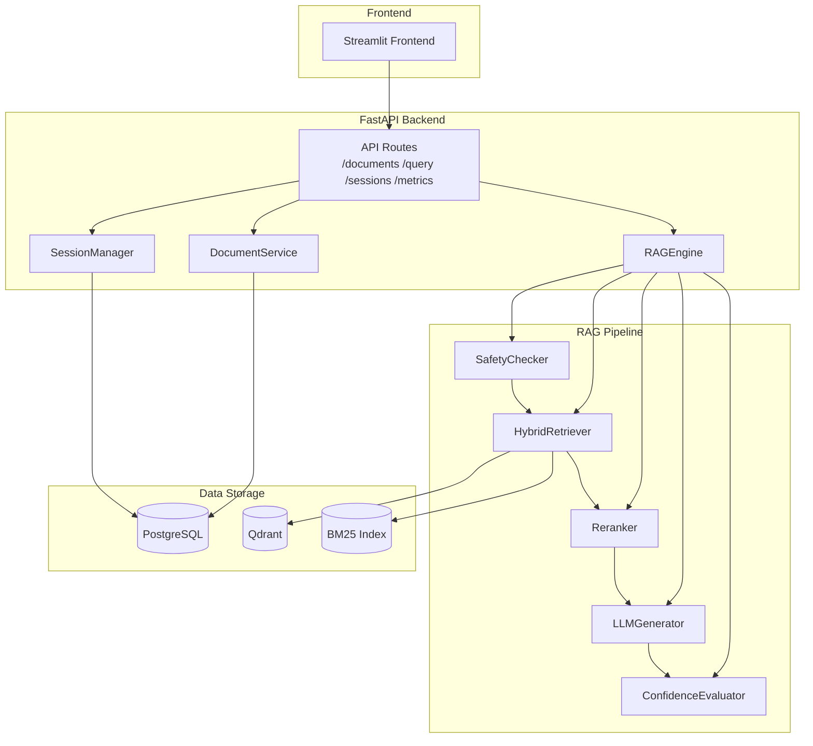
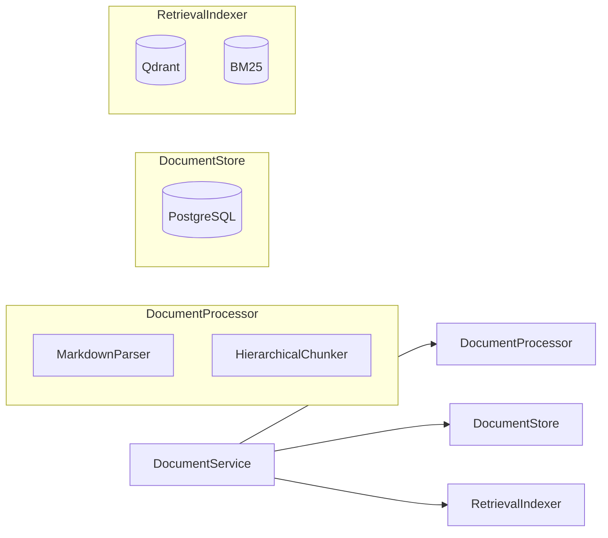

# Architecture Overview

## System Context

Medical Knowledge Base RAG Q&A System - a FastAPI-based RAG application for medical documentation with hybrid retrieval (BM25 + vector similarity), confidence scoring, and multi-turn conversation support.

## High-Level Architecture



## Component Responsibilities

### API Layer (`app/api/routes/`)
| Endpoint                             | Service           | Purpose                    |
| ------------------------------------ | ----------------- | -------------------------- |
| `POST /api/v1/documents/upload`      | DocumentService   | Upload single document     |
| `POST /api/v1/documents/upload/batch` | DocumentService | Batch upload (max 50)      |
| `GET /api/v1/documents/upload/batch/{id}/status` | DocumentService | Batch status |
| `GET /api/v1/documents`              | DocumentService   | List documents             |
| `DELETE /api/v1/documents/{id}`      | DocumentService   | Delete document            |
| `POST /api/v1/query`                 | RAGEngine         | Query the knowledge base   |
| `GET /api/v1/sessions`               | SessionManager    | List active sessions       |
| `GET /api/v1/sessions/{id}/messages` | SessionManager    | Get session history        |
| `GET /api/v1/metrics`                | PrometheusMetrics | Prometheus metrics         |

### Service Layer Composition



### DocumentService Composition
- **DocumentProcessor**: Parse Markdown documents → HierarchicalChunker with heading tree → content-type detection
- **DocumentStore**: PostgreSQL CRUD for documents, chunks, and headings
- **RetrievalIndexer**: Vector (Qdrant) and keyword (BM25) index operations

## Data Storage Architecture

### Three Independent Stores

| Store      | Purpose                            | Persistence                               | Key Operation     |
| ---------- | ---------------------------------- | ----------------------------------------- | ----------------- |
| PostgreSQL | Document records, chunks, sessions | Permanent                                 | Source of truth   |
| Qdrant     | Vector embeddings                  | Permanent                                 | Similarity search |
| BM25       | Keyword search index               | File-based (`data/cache/bm25_index.json`) | Keyword search    |

### Synchronization Rules

1. **Document Deletion Order**: PostgreSQL first → Qdrant → BM25
2. If PostgreSQL fails → abort deletion
3. If Qdrant/BM25 fail → log inconsistency, use `/cleanup-orphans` to repair

## Session & Message Persistence

```
┌─────────────────────────────────────────────────────────────┐
│ SessionManager                                              │
│  ├─ Memory Cache (dict) ─────────── Fast read/write         │
│  └─ PostgreSQL (source of truth) ─ Durability              │
└─────────────────────────────────────────────────────────────┘
```

**Message Flow**:
1. `POST /api/v1/query` with `session_id`
2. If `session_id` not provided → auto-create session
3. All messages saved to PostgreSQL
4. `GET /api/v1/sessions/{id}/messages` reads from PostgreSQL directly

**Message Limit**: `MAX_SESSION_MESSAGES = 100` with FIFO eviction (oldest user-assistant pair removed first)

## Key Files Reference

| File                                                       | Responsibility                                 |
| ---------------------------------------------------------- | ---------------------------------------------- |
| [app/main.py](../../app/main.py)                           | FastAPI app factory, CORS, router registration |
| [app/core/rag_engine.py](../../app/core/rag_engine.py)     | Main query orchestration                       |
| [app/services/document.py](../../app/services/document.py) | Document lifecycle management                  |
| [app/services/session.py](../../app/services/session.py)   | Session state, message eviction                |
| [config/settings.py](../../config/settings.py)             | Pydantic settings with YAML config             |
