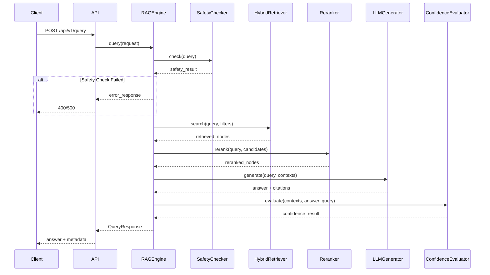

# RAG Pipeline

## Pipeline Flow



## Module Details

### 1. SafetyChecker

**File**: [app/core/safety.py](../../app/core/safety.py)

**Responsibility**: Content moderation, sensitive word detection

**Key Methods**:
- `check(text) -> SafetyResult`: Perform safety check
  - Returns: `passed`, `sanitized_text`, `detected_patterns`

### 2. HybridRetriever

**File**: [rag/retrieval/hybrid_retriever.py](../../rag/retrieval/hybrid_retriever.py)

**Responsibility**: Parallel BM25 + vector search with RRF fusion

**Key Methods**:
- `search(query, top_k, filters) -> list[RetrievedNode]`
- `_parallel_search()`: Execute vector and BM25 in parallel
- `_reciprocal_rank_fusion()`: RRF score combination

**Configuration** (from `settings.rag.retrieval`):
```python
weights = {"vector": 0.6, "bm25": 0.4}
rrf_k = 60
final_top_k = 5
```

### 3. Reranker (CrossEncoder)

**File**: [rag/reranker/cross_encoder.py](../../rag/reranker/cross_encoder.py)

**Responsibility**: Re-rank retrieved results using cross-encoder

**Key Methods**:
- `rerank(query, candidates) -> list[RerankedNode]`
- `is_on_gpu() -> bool`
- `move_to_cpu()`

**GPU Strategy**: Lazy-loaded, loads to GPU only during reranking

### 4. LLMGenerator

**File**: [rag/generation/llm_generator.py](../../rag/generation/llm_generator.py)

**Responsibility**: Generate answer with citations using DeepSeek

**Key Methods**:
- `generate(query, contexts, include_citations, include_confidence) -> dict`
  - Returns: `answer`, `citations`, `usage`

### 5. ConfidenceEvaluator

**File**: [app/core/confidence.py](../../app/core/confidence.py)

**Responsibility**: Score context relevance and answer completeness

**Key Methods**:
- `evaluate(contexts, answer, query) -> dict`
  - Returns: `confidence`, `context_relevance`, `answer_completeness`

### 6. RiskWarning Generator

**File**: [app/core/risk_warnings.py](../../app/core/risk_warnings.py)

**Responsibility**: Generate medical risk warnings based on answer content

**Warning Types**:
| Type       | Keywords             | Priority |
| ---------- | -------------------- | -------- |
| general    | -                    | low      |
| medication | 药物, 用药, 剂量     | medium   |
| diagnosis  | 诊断, 确诊, 治疗方案 | high     |
| emergency  | 紧急, 急诊, 立即     | high     |

## RAGEngine Query Flow

**File**: [app/core/rag_engine.py](../../app/core/rag_engine.py)

```python
async def query(self, request: QueryRequest) -> QueryResponse:
    # 1. Safety check
    safety_result = self._safety_check(request)
    if not safety_result.passed:
        return error_response

    # 2. Retrieve and rerank
    reranked_nodes = await self._retrieve_and_rerank(sanitized_query, filters)

    # 3. Generate answer
    llm_result = await self._generate_answer(query, reranked_nodes)

    # 4. Evaluate confidence
    confidence_result = self._evaluate_confidence(reranked_nodes, answer, query)

    # 5. Generate warnings if enabled
    warnings = self._generate_warnings(answer, reranked_nodes) if config.include_warnings

    return QueryResponse(
        answer=llm_result["answer"],
        confidence=confidence_result["confidence"],
        citations=llm_result.get("citations", []),
        warnings=warnings,
        session_id=request.session_id or "",
        processing_time=round(processing_time, 2),
        metadata={...}
    )
```

## Configuration Reference

**File**: [config/settings.py](../../config/settings.py)

```python
class RAGConfig(BaseModel):
    chunking: ChunkingConfig
    retrieval: RetrievalConfig  # weights, rrf_k, top_k
    generation: GenerationConfig  # include_citations, include_warnings
```

**YAML Config** (`config/config.yaml`):
```yaml
rag:
  retrieval:
    vector_top_k: 50
    bm25_top_k: 50
    rrf_k: 60
    weights:
      vector: 0.6
      bm25: 0.4
    final_top_k: 5
  generation:
    include_citations: true
    include_confidence: true
    include_warnings: true
```
