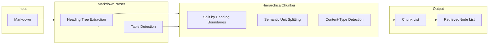
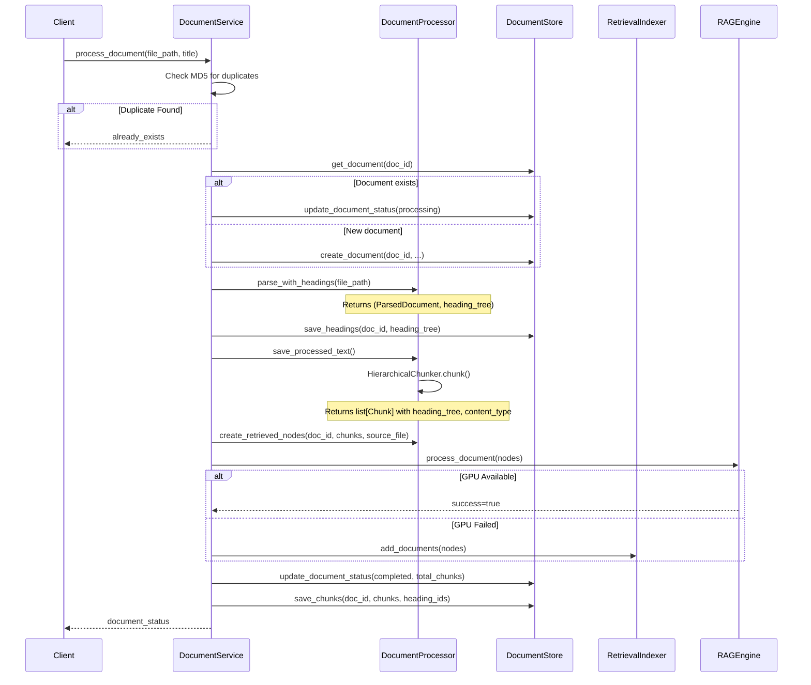
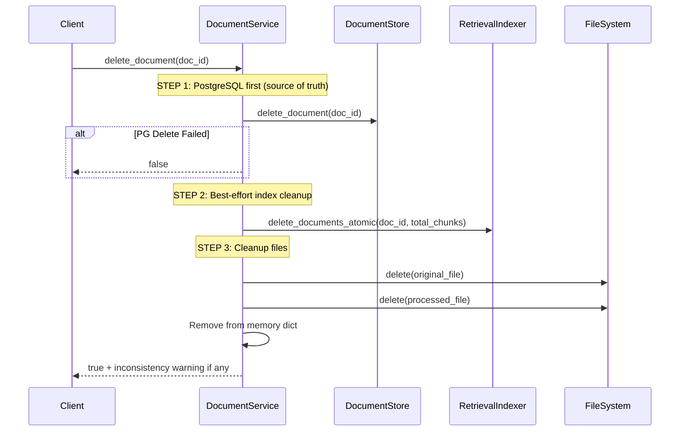
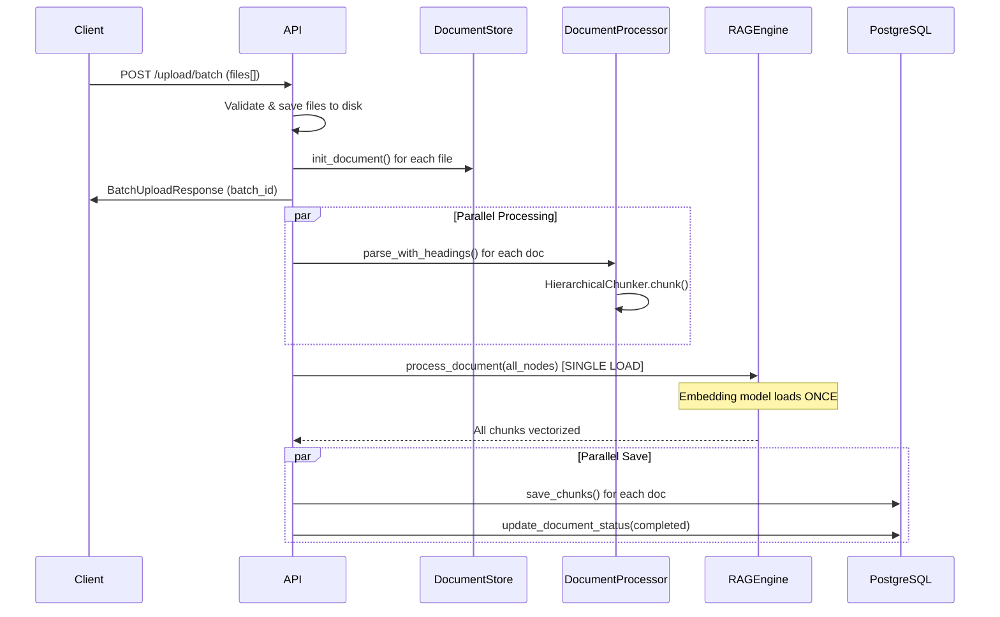

# Document Processing Pipeline

## Processing Flow



## Markdown-Only Processing

**Supported Formats**: `.md`, `.markdown` only. PDF and DOCX support has been removed due to parsing reliability issues.

## Parser Factory

**File**: [rag/parser/__init__.py](../../rag/parser/__init__.py)

**Entry Point**: `parse_document_with_headings(file_path) -> (ParsedDocument, heading_tree_list)`

**File**: [rag/parser/markdown_parser.py](../../rag/parser/markdown_parser.py)

### Heading Tree Extraction

```python
@dataclass
class HeadingNode:
    level: int           # 1-6 for H1-H6
    title: str
    line_number: int
    parent: HeadingNode | None = None
    children: list[HeadingNode] = field(default_factory=list)
```

The parser builds a tree of all headings, then flattens it for database storage with position-based parent references (`parent_position`).

### Table Detection

Tables are detected in two ways:
1. **Markdown table syntax**: Lines starting with `|` are parsed as table rows
2. **Table caption pattern**: `**表X**` or `**表X ...**` marks a table caption followed by table rows

## HierarchicalChunker

**File**: [rag/chunking/hierarchical_chunker.py](../../rag/chunking/hierarchical_chunker.py)

**Strategy**:
1. Split text by heading boundaries (H1-H6)
2. For each heading section:
   - If content length ≤ `max_chunk_length` → single chunk with heading context
   - If content length > `max_chunk_length` → split by semantic boundaries:
     - Tables → independent chunks
     - Paragraphs → merge until near max size
     - Lists → keep together if possible
3. Attach full heading tree context to each chunk

### Content-Type Detection

Each chunk is tagged with `content_type`:
- `"text"` - Regular paragraph content
- `"table"` - Markdown table rows (`| col1 | col2 |`)
- `"list"` - Bullet/numbered lists (`·`, `-`, `（1）`)

### Configuration

```python
chunk_size: 512           # target chunk size
chunk_overlap: 50          # overlap between chunks
max_chunk_length: 1000    # hard limit before forced split
min_chunk_length: 50      # minimum chunk size
strategy: "hierarchical"
```

## DocumentService Lifecycle

**File**: [app/services/document.py](../../app/services/document.py)

### Upload & Process Flow



### Document Deletion Flow



## Batch Upload

**File**: [app/api/routes/documents.py](../../app/api/routes/documents.py)

### API Endpoints

| 端点 | 方法 | 功能 |
|------|------|------|
| `/api/v1/documents/upload/batch` | POST | 批量上传多个文档，统一向量化 |
| `/api/v1/documents/upload/batch/{batch_id}/status` | GET | 查询批量上传进度 |

### Batch Upload Flow



### Key Design: Unified Vectorization

**问题**: 原来的实现是每个文档单独调用 `process_document_background()`，导致 embedding 模型反复加载/卸载。

**解决方案**: `process_batch_documents_background()` 函数收集所有文档的分块后，**一次性调用** `rag_engine.process_document(all_nodes)`，确保 embedding 模型只加载一次。

### Request/Response Models

```python
class BatchUploadItem(BaseModel):
    document_id: str
    file_name: str
    status: str  # "processing" | "completed" | "failed" | "duplicate"
    error_message: str | None = None

class BatchUploadResponse(BaseModel):
    batch_id: str
    total: int
    succeeded: int
    failed: int
    duplicate: int
    items: list[BatchUploadItem]
    message: str

class BatchUploadStatus(BaseModel):
    batch_id: str
    total: int
    processing: int
    completed: int
    failed: int
    duplicate: int
    items: list[BatchUploadItem]
```

### Configuration

| 参数 | 值 | 说明 |
|------|-----|------|
| `MAX_BATCH_SIZE` | 50 | 单批次最大文件数 |
| `MAX_CONCURRENT` | 5 | 解析阶段的并发控制（Semaphore） |

### Error Handling

- 单文件失败不影响其他文件（错误隔离）
- MD5 去重检测：重复文件返回 `duplicate` 状态
- PostgreSQL 保存失败会 rollback 该文档
- 向量化失败会 fallback 到 CPU 模式

## Chunk Metadata

**File**: [app/models/schemas.py](../../app/models/schemas.py)

```python
class ChunkMetadata(BaseModel):
    source_file: str = ""
    section_title: str | None = None      # Primary heading title
    heading_tree: dict[int, str] | None = None  # {1: "H1", 2: "H2", ...}
    content_type: str | None = None      # "text" | "table" | "list"
    char_count: int = 0
    position: int = 0
    heading_level: int | None = None       # H1=1, H2=2, ... H6=6
```

## Query-Type Boosting

During retrieval, queries are analyzed to detect content-type intent:

| Pattern | Detected Type | Example Queries |
|---------|---------------|-----------------|
| `表[一二三四五六七八九十\d]+` | `table` | "表1的数据", "表10的诊断标准" |
| `表格`, `table` | `table` | "表格中的结果" |
| `列出`, `列表中` | `list` | "列出所有药物" |
| `剂量`, `用法`, `mg` | `list` | "每次剂量是多少", "每日服用几次" |

When a query type is detected, results matching that content_type are boosted to the top.

## Data Flow

```
Upload .md File
    │
    ▼
DocumentService.process_document()
    │
    ├──► MarkdownParser.parse_with_headings() → ParsedDocument + heading_tree
    │        │
    │        ├──► Heading tree → DocumentStore.save_headings()
    │        └──► Text content → HierarchicalChunker.chunk() → list[Chunk]
    │             └──► Each chunk: heading_tree + content_type metadata
    │
    ├──► RAGEngine.process_document() or RetrievalIndexer.add_documents()
    │        │
    │        ├──► Qdrant (vector embeddings with heading_tree, content_type)
    │        └──► BM25 (keyword index)
    │
    └──► DocumentStore.save_chunks() → PostgreSQL (with heading_id FK)
```
