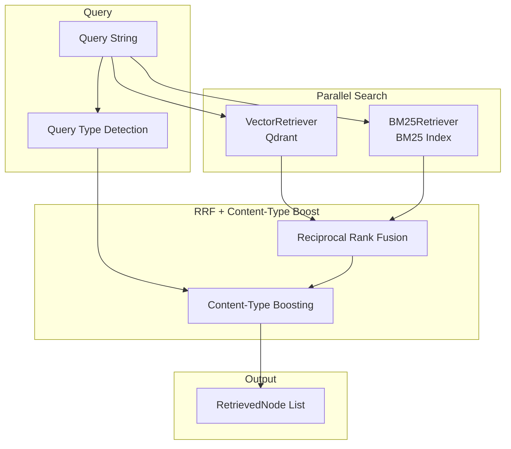

# Retrieval System

## Hybrid Retrieval Architecture



## Query Type Detection

**File**: [rag/retrieval/hybrid_retriever.py](../../rag/retrieval/hybrid_retriever.py)

The retriever analyzes query text to detect content-type intent:

```python
table_query_patterns = [
    r"表[一二三四五六七八九十\d]+",  # 表1, 表二, 表10
    r"表格",
    r"table",
]

list_query_patterns = [
    r"列出",
    r"列表中",
    r"列表项",
    r"哪些.*列表",
    r"list",
]

drug_query_patterns = [
    r"剂量",
    r"用法",
    r"每次",
    r"每日",
    r"mg",
    r"毫升",
    r"不良反应",
    r"禁忌",
    r"药物",
]
```

Detected query types are used to boost results with matching `content_type`.

## Vector Retrieval

**File**: [rag/retrieval/vector_retriever.py](../../rag/retrieval/vector_retriever.py)

**Model**: BAAI/bge-m3 (dimension: 1024, normalize: true)

**Key Methods**:
- `add(nodes)`: Add document embeddings to Qdrant
- `retrieve(query, top_k, filters)`: Search by vector similarity
- `delete(ids)`: Delete by vector IDs
- `load_embedding_to_gpu()`: Load BGE-M3 embedding model to GPU
- `move_embedding_to_cpu()`: Move embedding model to CPU

### Qdrant Payload Structure

```python
payload = {
    "doc_id": doc_id,
    "doc_title": document.title,
    "node_id": node.node_id,
    "content": node.content,
    "heading_id": chunk.heading_id,           # NEW: FK to Heading
    "heading_tree": chunk.metadata.heading_tree,  # {1: "H1", 2: "H2", ...}
    "content_type": chunk.metadata.content_type,  # "text" | "table" | "list"
    "section_title": chunk.metadata.section_title,
    "position": chunk.metadata.position,
    "source_file": chunk.metadata.source_file,
}
```

### Filter Support

Vector retrieval supports filtering by:
- `doc_id` - Document ID
- `heading_id` - Heading ID (NEW)
- `content_type` - Content type filter ("text", "table", "list") (NEW)
- `source_file` - Source file name

## BM25 Retrieval

**File**: [rag/retrieval/bm25_retriever.py](../../rag/retrieval/bm25_retriever.py)

**Tokenizer**: jieba (Chinese word segmentation)

**Key Methods**:
- `add(nodes)`: Build/update BM25 index
- `retrieve(query, top_k, filters)`: Search by keywords
- `delete(ids)`: Remove from index
- `save_index()`: Persist to `data/cache/bm25_index.json`

### Filter Support

BM25 retrieval supports the same filters as vector retrieval:
- `doc_id`
- `heading_id` (NEW)
- `content_type` (NEW)
- `source_file`

### Metadata Storage

```python
metadata = {
    "doc_id": node.metadata.get("doc_id", ""),
    "source_file": node.metadata.get("source_file", ""),
    "heading_tree": node.metadata.get("heading_tree", {}),
    "content_type": node.metadata.get("content_type", "text"),
    "section_title": node.metadata.get("section_title", ""),
    "position": node.metadata.get("position", 0),
}
```

## Reciprocal Rank Fusion (RRF)

**Formula**:
```
RRF_score(doc) = Σ (weight_r * 1 / (k + rank_r(doc)))
```

Where:
- `weight_r` = weight for retriever r (vector: 0.6, bm25: 0.4)
- `k` = 60 (constant)
- `rank_r(doc)` = rank position from retriever r

**Implementation**:
```python
def _reciprocal_rank_fusion(self, vector_results, bm25_results):
    scores = {}
    for rank, node in enumerate(vector_results):
        rrf_score = 1 / (self.rrf_k + rank + 1)
        scores[node.node_id] += self.vector_weight * rrf_score

    for rank, node in enumerate(bm25_results):
        rrf_score = 1 / (self.rrf_k + rank + 1)
        scores[node.node_id] += self.bm25_weight * rrf_score

    return sorted by scores descending
```

## Content-Type Boosting

After RRF fusion, if a query type was detected, results are boosted:

```python
def _boost_by_content_type(self, results, target_type):
    boosted = []
    other = []
    for node in results:
        if node.metadata.get("content_type") == target_type:
            boosted.append(node)
        else:
            other.append(node)
    boosted.extend(other)
    return boosted
```

This ensures tables appear first for table queries, lists first for drug queries.

## Cross-Encoder Reranking

**File**: [rag/reranker/cross_encoder.py](../../rag/reranker/cross_encoder.py)

**Model**: BAAI/bge-reranker-v2-m3

**Key Methods**:
- `rerank(query, candidates) -> list[RerankedNode]`
- `is_on_gpu() -> bool`
- `move_to_cpu()`
- `move_to_gpu()`

**GPU Strategy**:
- Lazy-loaded (only loads when reranking)
- If GPU memory insufficient, falls back to CPU

## Data Synchronization

### Consistency Check Endpoints

```bash
# Check consistency across all three stores
GET /api/v1/documents/consistency-check

# Clean orphaned data from Qdrant/BM25
POST /api/v1/documents/cleanup-orphans
```

**File**: [app/services/consistency.py](../../app/services/consistency.py)

### Deletion Order

| Step | Store      | Action                            |
| ---- | ---------- | --------------------------------- |
| 1    | PostgreSQL | Delete document record (source of truth) |
| 2    | Qdrant     | Delete vector embeddings          |
| 3    | BM25       | Remove from keyword index         |

If Step 1 fails → abort
If Step 2/3 fail → log inconsistency, use cleanup endpoint

## Configuration

**File**: [config/settings.py](../../config/settings.py)

```python
class RetrievalConfig(BaseModel):
    vector_top_k: int = 50       # Initial vector search
    bm25_top_k: int = 50         # Initial BM25 search
    fusion_method: str = "rrf"
    rrf_k: int = 60              # RRF constant
    weights: dict = {"vector": 0.6, "bm25": 0.4}
    final_top_k: int = 5          # Final result count after reranking
    similarity_threshold: float = 0.5
```

**YAML Config** (`config/config.yaml`):
```yaml
rag:
  retrieval:
    vector_top_k: 50
    bm25_top_k: 50
    rrf_k: 60
    weights:
      vector: 0.6
      bm25: 0.4
    final_top_k: 5
```
