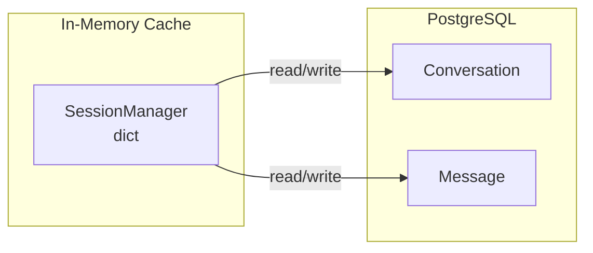
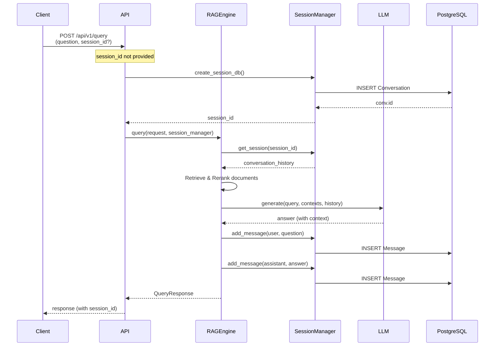
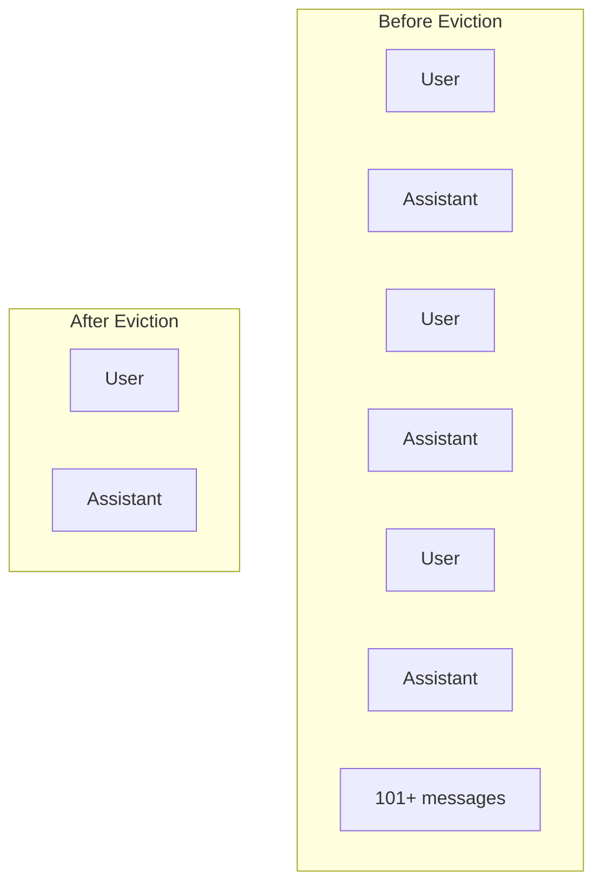
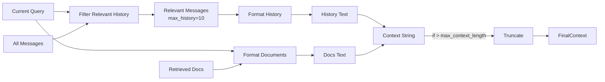

# Session Management

## Session Architecture



## SessionManager

**File**: [app/services/session.py](../../app/services/session.py)

**Responsibility**: Session state management, message persistence, FIFO eviction

### Key Attributes

```python
MAX_SESSION_MESSAGES = 100
max_history = 10          # For context building
max_context_length = 4000 # Token limit
```

## Message Flow

### Session Auto-Creation & Multi-Turn Flow



### Message Eviction (FIFO)



**Eviction Logic**:
1. When `len(messages) > MAX_SESSION_MESSAGES`
2. Remove oldest **user-assistant pair** (2 messages at a time)
3. Mark evicted messages in PostgreSQL with `extra_data: {"evicted": True}`
4. Update `messages` list in memory

## Database Schema

### Conversation Table

| Column        | Type     | Description                          |
| ------------- | -------- | ------------------------------------ |
| id            | UUID     | Primary key (session_id)             |
| session_title | String   | First 50 chars of first user message |
| created_at    | DateTime | Creation timestamp                   |
| updated_at    | DateTime | Last update timestamp                |
| message_count | Integer  | Total message count                  |
| is_active     | Boolean  | Soft delete flag                     |

### Message Table

| Column     | Type     | Description                   |
| ---------- | -------- | ----------------------------- |
| id         | UUID     | Primary key                   |
| session_id | UUID     | FK to Conversation            |
| role       | String   | "user" or "assistant"         |
| content    | Text     | Message content               |
| confidence | Float    | Confidence score (nullable)   |
| citations  | JSONB    | Citation list (in extra_data) |
| warnings   | JSONB    | Warning list (in extra_data)  |
| extra_data | JSONB    | Metadata (JSON stored here)   |
| created_at | DateTime | Creation timestamp            |

**Note**: `confidence` is a Float column. `citations` and `warnings` are stored in `extra_data` JSONB column because `citations` is a reserved word in SQLAlchemy.

## Context Building



**Filtering Algorithm**:
1. Extract query terms (lowercase split)
2. Score each message by term overlap with query
3. Select messages with overlap >= 0.3 threshold
4. Fallback: return last 3 messages if none pass threshold

**Usage in LLM Prompt**:

The filtered history is passed to `LLMGenerator.generate(..., conversation_history)` as a list of dicts:

```python
conversation_history = [
    {"role": "user", "content": "糖尿病有什么症状？"},
    {"role": "assistant", "content": "多饮、多尿、多食、体重下降。"},
]
```

In `build_user_prompt()` (rag/generation/prompt.py), history is formatted:

```
## 对话历史
**用户**: 糖尿病有什么症状？

**助手**: 多饮、多尿、多食、体重下降。

## 参考信息
...

## 用户问题
如何诊断糖尿病？
```

**Note**: `build_context()` in SessionManager returns a formatted string used for display/logging. The actual history injection to LLM uses raw message data from `session.messages` passed directly to `LLMGenerator`.

## Key Methods

| Method                        | Description                       |
| ----------------------------- | --------------------------------- |
| `create_session()`            | Create in-memory session          |
| `create_session_db()`         | Create in PostgreSQL, set `db_confirmed=True` |
| `add_message()`               | Add message + evict if needed     |
| `get_messages()`              | Get session messages              |
| `get_session()`              | Get session from memory cache     |
| `delete_session()`            | Soft delete (set `is_active=False`) |
| `build_context()`             | Build context string for display   |
| `_filter_relevant_history()`  | Filter history by query relevance |
| `_evict_messages_if_needed()` | FIFO eviction logic               |

**`db_confirmed` Flag**: When a session is created via `create_session_db()`, `db_confirmed=True` is set on the `ConversationSession` model. This ensures `add_message()` knows to persist messages to PostgreSQL even when the session already exists in memory.

## API Endpoints

| Endpoint                         | Method | Description                          |
| -------------------------------- | ------ | ------------------------------------ |
| `/api/v1/sessions`               | GET    | List active sessions from PostgreSQL |
| `/api/v1/sessions/{id}`          | GET    | Get session details                  |
| `/api/v1/sessions/{id}/messages` | GET    | Get message history                  |
| `/api/v1/sessions/{id}`          | DELETE | Soft delete session                  |

**Note**: Sessions are read directly from PostgreSQL (not in-memory cache) to ensure consistency.
