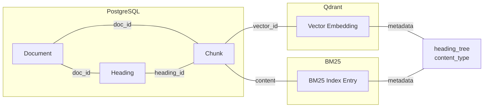

# Data Models

## Model Architecture

```mermaid
erDiagram
    Document ||--o{ Chunk : "has"
    Document ||--o{ Heading : "has"
    Heading ||--o{ Heading : "has (parent-child)"
    Document ||--o{ Conversation : "has"
    Conversation ||--o{ Message : "has"

    Document {
        uuid id PK
        string title
        string file_name
        string file_path
        string file_type
        string file_md5 index
        string status
        int total_chunks
        datetime created_at
        datetime updated_at
        json extra_data
        array tags
    }

    Heading {
        uuid id PK
        uuid doc_id FK
        uuid parent_id FK "self-referential, nullable"
        int level "1-6 for H1-H6"
        string title
        int position
    }

    Chunk {
        uuid id PK
        uuid doc_id FK
        uuid heading_id FK "nullable, -> Heading"
        string content
        int char_count
        int position
        string content_type "text|table|list"
        string section_title
        string vector_id
        datetime created_at
        json extra_data
    }

    Conversation {
        uuid id PK
        string session_title
        datetime created_at
        datetime updated_at
        int message_count
        boolean is_active
    }

    Message {
        uuid id PK
        uuid session_id FK
        string role
        text content
        float confidence
        json citations
        json warnings
        json extra_data
        datetime created_at
    }
```

## Database Models

**File**: [app/models/database.py](../../app/models/database.py)

### Document
```python
class Document(Base):
    __tablename__ = "documents"

    id: Mapped[uuid.UUID] = mapped_column(UUID(as_uuid=True), primary_key=True)
    title: Mapped[str]
    file_name: Mapped[str]
    file_path: Mapped[str]
    file_type: Mapped[str]
    file_size: Mapped[int | None]  # File size in bytes (NEW)
    file_md5: Mapped[str | None] = mapped_column(index=True)
    status: Mapped[str] = default="pending"
    total_pages: Mapped[int | None]  # Page count (NEW)
    total_chunks: Mapped[int | None]
    created_at: Mapped[datetime]
    updated_at: Mapped[datetime]
    error_message: Mapped[str | None]
    extra_data: Mapped[dict[str, Any] | None]  # JSON
    tags: Mapped[list[str]]  # ARRAY

    chunks: Mapped[list["Chunk"]] = relationship(back_populates="document")
    headings: Mapped[list["Heading"]] = relationship(back_populates="document")
```

### Heading (NEW)
```python
class Heading(Base):
    __tablename__ = "headings"

    id: Mapped[uuid.UUID] = mapped_column(UUID(as_uuid=True), primary_key=True)
    doc_id: Mapped[uuid.UUID] = mapped_column(ForeignKey("documents.id", ondelete="CASCADE"))
    parent_id: Mapped[uuid.UUID | None] = mapped_column(ForeignKey("headings.id", ondelete="CASCADE"), nullable=True)
    level: Mapped[int]  # 1-6 for H1-H6
    title: Mapped[str]
    position: Mapped[int]  # Order in document

    # Self-referential parent-child relationship
    parent: Mapped["Heading | None"] = relationship("Heading", remote_side=[id], back_populates="children")
    children: Mapped[list["Heading"]] = relationship("Heading", back_populates="parent", cascade="all, delete-orphan")

    # Document association
    document: Mapped["Document"] = relationship("Document", back_populates="headings")
    chunks: Mapped[list["Chunk"]] = relationship("Chunk", back_populates="heading")
```

### Chunk
```python
class Chunk(Base):
    __tablename__ = "chunks"

    id: Mapped[uuid.UUID] = mapped_column(UUID(as_uuid=True), primary_key=True)
    doc_id: Mapped[uuid.UUID] = mapped_column(ForeignKey("documents.id", ondelete="CASCADE"))
    heading_id: Mapped[uuid.UUID | None] = mapped_column(ForeignKey("headings.id", ondelete="SET NULL"), nullable=True)
    content: Mapped[str]
    token_count: Mapped[int | None]  # Token count for the chunk (NEW)
    char_count: Mapped[int | None]
    position: Mapped[int | None]
    content_type: Mapped[str | None]  # "text" | "table" | "list"
    section_title: Mapped[str | None]
    vector_id: Mapped[str | None]
    created_at: Mapped[datetime]
    extra_data: Mapped[dict[str, Any] | None]  # JSON

    document: Mapped["Document"] = relationship("Document", back_populates="chunks")
    heading: Mapped["Heading | None"] = relationship("Heading", back_populates="chunks")
```

**Note**: `page_number` column has been removed since Markdown-only processing makes page numbers meaningless. However, `token_count` is still stored as it is derived during chunking and useful for context management.

### Conversation
```python
class Conversation(Base):
    __tablename__ = "conversations"

    id: Mapped[uuid.UUID] = mapped_column(UUID(as_uuid=True), primary_key=True)
    session_title: Mapped[str | None]
    created_at: Mapped[datetime]
    updated_at: Mapped[datetime]
    message_count: Mapped[int] = default=0
    is_active: Mapped[bool] = default=True

    messages: Mapped[list["Message"]] = relationship(back_populates="conversation")
```

### Message
```python
class Message(Base):
    __tablename__ = "messages"

    id: Mapped[uuid.UUID] = mapped_column(UUID(as_uuid=True), primary_key=True)
    session_id: Mapped[uuid.UUID] = mapped_column(ForeignKey("conversations.id", ondelete="CASCADE"))
    role: Mapped[str]  # "user" or "assistant"
    content: Mapped[str]
    confidence: Mapped[float | None]  # Float, NOT in JSON
    citations: Mapped[list[dict] | None]  # JSONB via extra_data
    warnings: Mapped[list[dict] | None]  # JSONB via extra_data
    extra_data: Mapped[dict[str, Any] | None]  # JSON - use instead of 'metadata'
    created_at: Mapped[datetime]
```

## API Schemas

**File**: [app/models/schemas.py](../../app/models/schemas.py)

### Core Schemas

| Schema                | Description                  |
| --------------------- | ---------------------------- |
| `QueryRequest`        | User query input             |
| `QueryResponse`       | RAG query response           |
| `DocumentStatus`      | Document processing status   |
| `RetrievedNode`       | Retrieved document chunk     |
| `Chunk`               | Document chunk with metadata |
| `ConversationSession` | Session with messages        |
| `Message`             | Chat message                 |

### QueryRequest
```python
class QueryRequest(BaseModel):
    question: str
    session_id: str | None = None
    filters: dict[str, Any] | None = None
```

### QueryResponse
```python
class QueryResponse(BaseModel):
    answer: str
    confidence: float
    citations: list[dict[str, Any]]
    warnings: list[RiskWarning]
    session_id: str
    processing_time: float
    metadata: dict[str, Any]
```

### RiskWarning
```python
class RiskWarning(BaseModel):
    type: str           # general, medication, diagnosis, emergency
    message: str
    priority: str       # low, medium, high
```

## Three-Store Data Mapping



### Qdrant Payload Structure

The vector payload stores derived metadata from PostgreSQL for filtering:

```python
payload = {
    "doc_id": doc_id,
    "doc_title": document.title,
    "node_id": node.node_id,
    "content": node.content,
    "heading_id": chunk.heading_id,           # FK to Heading table
    "heading_tree": chunk.metadata.heading_tree,  # {1: "H1", 2: "H2", 3: "H3"}
    "content_type": chunk.metadata.content_type,  # "text" | "table" | "list"
    "section_title": chunk.metadata.section_title,
    "position": chunk.metadata.position,
    "source_file": chunk.metadata.source_file,
}
```

### BM25 Metadata Structure

```python
metadata = {
    "doc_id": node.metadata.get("doc_id", ""),
    "source_file": node.metadata.get("source_file", ""),
    "heading_tree": node.metadata.get("heading_tree", {}),
    "content_type": node.metadata.get("content_type", "text"),
    "section_title": node.metadata.get("section_title", ""),
    "position": node.metadata.get("position", 0),
}
```

### ID Consistency for Deletion

| Store      | ID Type | Generation                       |
| ---------- | ------- | -------------------------------- |
| PostgreSQL | UUID v4 | Auto-generated                   |
| Qdrant     | String  | UUID v5 with `doc_id_chunkindex` |
| BM25       | String  | Same as Qdrant                   |

**Critical**: Chunk ID generation must be identical across stores:
```python
chunk_id = str(uuid.uuid5(uuid.NAMESPACE_DNS, f"{doc_id}_{i}"))
```

### Filter Support

Vector and BM25 retrieval support filtering by:
- `doc_id` - Document ID
- `heading_id` - Heading ID (NEW)
- `content_type` - Content type ("text", "table", "list") (NEW)
- `source_file` - Source file name
```
