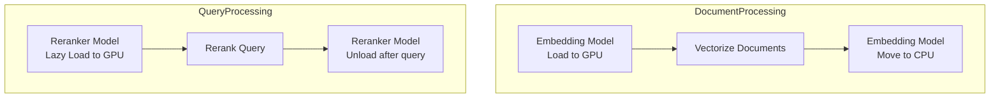

# GPU Memory Management

## GPUMemoryManager Overview

**File**: [app/core/gpu_memory_manager.py](../../app/core/gpu_memory_manager.py)

**Pattern**: Singleton

**Responsibility**: Dynamic GPU memory allocation for limited VRAM (e.g., 4GB)

## Memory Strategy



## Key Design Principles

1. **Embedding**: GPU during document vectorization → CPU during query retrieval
2. **Reranker**: Stays lazy-loaded, loads to GPU only during query reranking
3. Uses `torch.cuda.mem_get_info()` to get true free memory (not PyTorch cached)
4. 500MB safety margin reserved for allocation overhead

## GPUMemoryManager API

```python
class GPUMemoryManager:
    _instance: Optional["GPUMemoryManager"] = None

    def get_instance(cls) -> "GPUMemoryManager"

    def get_memory_info(self) -> dict:
        """
        Returns:
            {
                "available": bool,
                "total_mb": float,
                "used_mb": float,
                "reserved_mb": float,
                "free_mb": float  # True free memory
            }
        """

    def can_load_model(self, model_name: str, required_mb: float) -> bool:
        """
        Check if GPU has enough memory for model.
        Includes 500MB safety margin.
        """

    def register_model(self, model_name: str, memory_mb: float) -> bool
    def unregister_model(self, model_name: str) -> bool
    def is_model_loaded(self, model_name: str) -> bool

    def move_model_to_cpu(self, model_name: str) -> bool
    def move_model_to_gpu(self, model_name: str) -> bool
```

## Memory Info Implementation

```python
def get_memory_info(self) -> dict:
    if not torch.cuda.is_available():
        return {"available": False, ...}

    total = torch.cuda.get_device_properties(0).total_memory / (1024**2)
    allocated = torch.cuda.memory_allocated(0) / (1024**2)
    reserved = torch.cuda.memory_reserved(0) / (1024**2)

    # Get true free memory (not PyTorch cached)
    try:
        free_bytes, _ = torch.cuda.mem_get_info()
        true_free_mb = free_bytes / (1024**2)
    except Exception:
        true_free_mb = total - reserved

    return {
        "available": True,
        "total_mb": round(total, 2),
        "used_mb": round(allocated, 2),
        "reserved_mb": round(reserved, 2),
        "free_mb": round(true_free_mb, 2),
    }
```

## Model Memory Estimates

From [config/settings.py](../../config/settings.py):

| Model              | Estimated Memory |
| ------------------ | ---------------- |
| BGE-M3 (embedding) | 1536 MB          |
| BGE-Reranker-v2-m3 | 1843 MB          |

## Device Selection Flow

### Document Vectorization

```
1. Check if reranker is on GPU → move to CPU if yes
2. Load embedding model to GPU
3. Vectorize documents
4. Move embedding model to CPU (keep model object)
5. Reranker remains lazy-loaded
```

**Code** ([app/core/rag_engine.py](../../app/core/rag_engine.py)):
```python
async def process_document(self, nodes: list[RetrievedNode]) -> bool:
    # Step 1: Move reranker to CPU if on GPU
    if self.reranker.is_on_gpu():
        self.reranker.move_to_cpu()

    # Step 2: Load embedding to GPU
    if not vector_retriever.load_embedding_to_gpu():
        return False

    # Step 3: Vectorize
    await self.hybrid_retriever.add_documents(nodes)

    # Step 4: Move embedding to CPU
    vector_retriever.move_embedding_to_cpu()

    # Step 5: Reranker stays lazy-loaded
```

### Query Reranking

```
1. Reranker tries to load to GPU
2. If can_load_model returns true → use GPU
3. Else → fall back to CPU
```

## Safety Margin

```python
safe_margin = 500  # MB

def can_load_model(self, model_name: str, required_mb: float) -> bool:
    info = self.get_memory_info()
    available_for_new = info["free_mb"]
    usable = available_for_new - safe_margin
    return usable >= required_mb
```

## Troubleshooting

### Out of Memory

1. Check `GET /api/v1/metrics` for GPU memory metrics
2. Verify no models are stuck on GPU
3. Reduce batch sizes in config
4. Restart service to clear GPU state

### Memory Leaks

If GPU memory grows over time:
1. Verify models properly move to CPU after use
2. Check `GPUMemoryManager.get_loaded_models()` for orphaned models
3. Consider calling `reset()` on manager during maintenance windows
