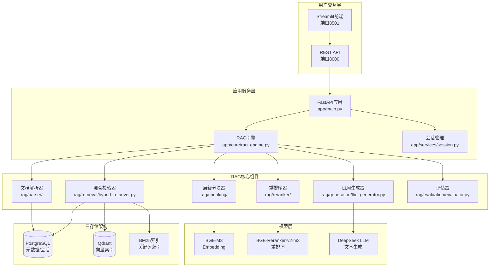
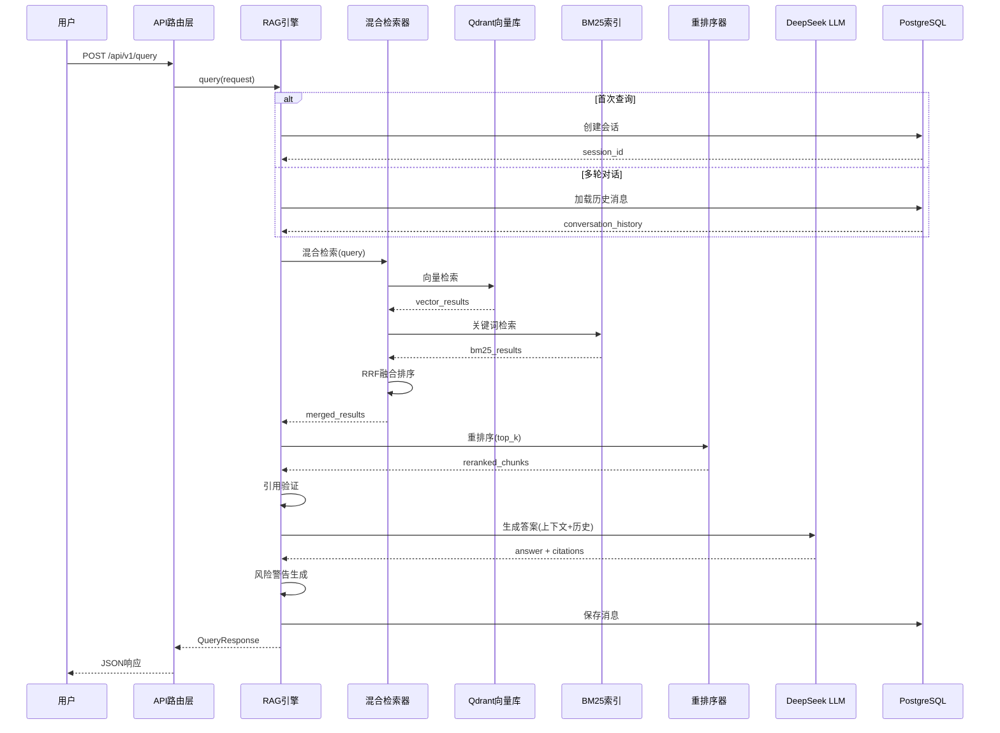
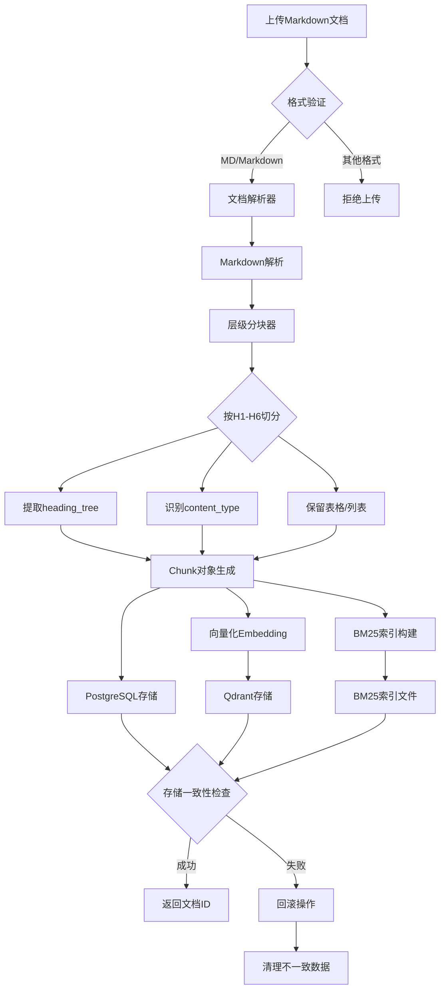
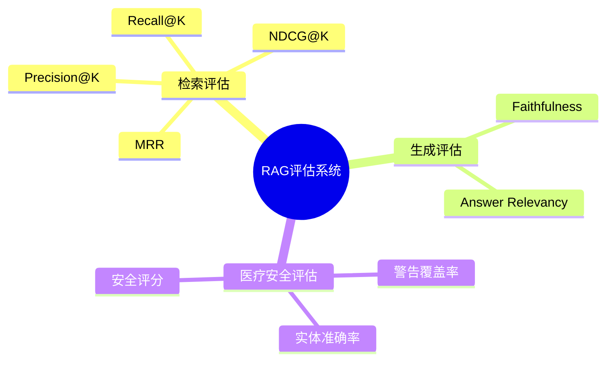
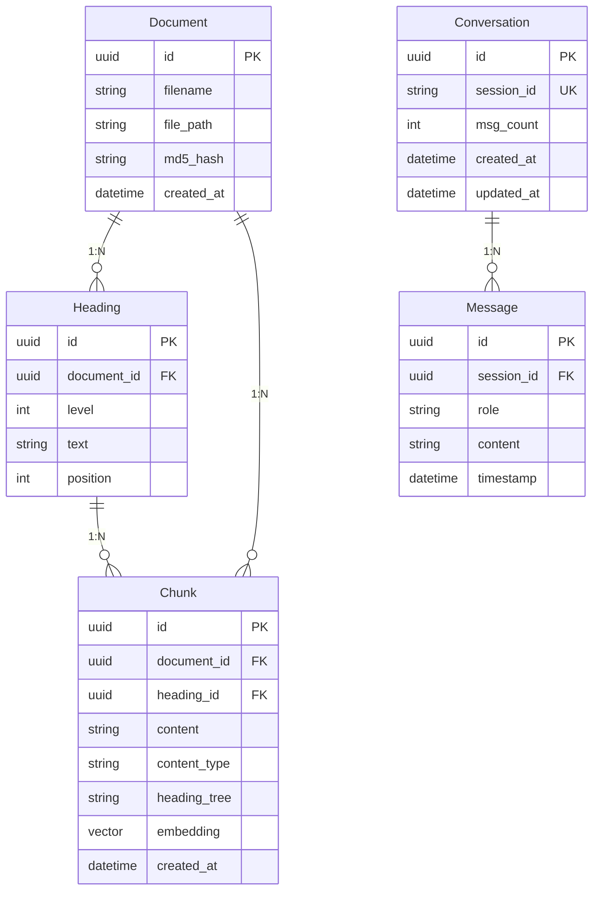

# 附录：医疗知识库RAG问答系统关键技术文档

## 附录A：系统架构设计

### A.1 系统整体架构

本系统采用三层架构设计，包括数据层、服务层和接口层，通过混合检索和生成式AI技术实现医疗领域的智能问答。



### A.2 RAG查询流程架构



### A.3 文档处理流程



---

## 附录B：核心代码实现

### B.1 RAG引擎核心实现

**文件位置**: `app/core/rag_engine.py`

```python
class RAGEngine:
    """RAG查询编排入口"""

    def __init__(self):
        self.document_service = DocumentService()
        self.session_service = SessionService()
        self.hybrid_retriever = HybridRetriever()
        self.llm_generator = LLMGenerator()
        self.risk_generator = RiskWarningGenerator()

    async def query(self, request: QueryRequest) -> QueryResponse:
        """执行完整的RAG查询流程"""
        
        # 1. 会话管理
        if not request.session_id:
            session = await self.session_service.create_session()
            request.session_id = session.id
        else:
            session = await self.session_service.get_session(request.session_id)
            # 加载历史消息
            history = await self.session_service.get_messages(session.id)
            request.conversation_history = history

        # 2. 混合检索
        retrieval_results = await self.hybrid_retriever.retrieve(
            query=request.query,
            top_k=request.top_k or 5
        )

        # 3. 重排序
        reranked = await self.reranker.rerank(
            query=request.query,
            chunks=retrieval_results,
            top_n=request.top_n or 3
        )

        # 4. 引用验证
        verified_chunks, warnings = self._verify_citations(reranked)

        # 5. LLM生成
        answer = await self.llm_generator.generate(
            query=request.query,
            chunks=verified_chunks,
            history=request.conversation_history
        )

        # 6. 风险警告
        risk_warnings = self._generate_warnings(answer, verified_chunks)

        # 7. 持久化消息
        await self.session_service.add_message(
            session_id=session.id,
            role="user",
            content=request.query
        )
        await self.session_service.add_message(
            session_id=session.id,
            role="assistant",
            content=answer
        )

        return QueryResponse(
            answer=answer,
            citations=[c.metadata for c in verified_chunks],
            session_id=session.id,
            warnings=risk_warnings
        )
```

### B.2 混合检索器实现

**文件位置**: `rag/retrieval/hybrid_retriever.py`

```python
class HybridRetriever:
    """混合检索器 - 结合向量检索和BM25关键词检索"""

    def __init__(self):
        self.vector_retriever = VectorRetriever()
        self.bm25_retriever = BM25Retriever()
        self.query_type_detector = QueryTypeDetector()

    async def retrieve(self, query: str, top_k: int = 5) -> List[Chunk]:
        """执行混合检索并返回融合结果"""

        # 1. 查询类型检测（用于内容类型boosting）
        query_type = self.query_type_detector.detect(query)

        # 2. 并行执行两种检索
        vector_results = await self.vector_retriever.search(
            query=query,
            top_k=top_k * 2,
            content_type_boost=query_type
        )
        bm25_results = await self.bm25_retriever.search(
            query=query,
            top_k=top_k * 2,
            content_type_boost=query_type
        )

        # 3. RRF融合排序
        merged = self._rrf_merge(
            vector_results=vector_results,
            bm25_results=bm25_results,
            vector_weight=0.6,
            bm25_weight=0.4,
            k=60  # RRF常数项
        )

        return merged[:top_k]

    def _rrf_merge(self, vector_results, bm25_results, 
                   vector_weight=0.6, bm25_weight=0.4, k=60):
        """Reciprocal Rank Fusion - 倒数排名融合"""
        scores = {}

        # 向量检索结果评分
        for rank, chunk in enumerate(vector_results, 1):
            rrf_score = vector_weight * (1 / (k + rank))
            scores[chunk.id] = scores.get(chunk.id, 0) + rrf_score

        # BM25检索结果评分
        for rank, chunk in enumerate(bm25_results, 1):
            rrf_score = bm25_weight * (1 / (k + rank))
            scores[chunk.id] = scores.get(chunk.id, 0) + rrf_score

        # 按融合分数排序
        sorted_ids = sorted(scores.items(), key=lambda x: x[1], reverse=True)
        
        # 重建排序后的chunk列表
        chunk_map = {c.id: c for c in vector_results + bm25_results}
        return [chunk_map[id] for id, score in sorted_ids]
```

### B.3 层级分块器实现

**设计要点**: 按H1-H6标题边界切分，保留表格和列表为独立语义单元

```python
class HierarchicalChunker:
    """层级感知分块器"""

    def chunk(self, document: Document) -> List[Chunk]:
        """按标题层级切分文档"""
        chunks = []
        current_chunk = None
        heading_stack = []  # 当前标题路径

        for element in self._parse_markdown(document.content):
            if element.type == "heading":
                # 遇到新标题，保存前一个chunk
                if current_chunk:
                    chunks.append(current_chunk)
                
                # 更新标题栈
                heading_stack = heading_stack[:element.level-1]
                heading_stack.append(element.text)
                
                # 创建新chunk
                current_chunk = Chunk(
                    content=element.text + "\n",
                    heading_tree=list(heading_stack),
                    content_type="text",
                    document_id=document.id
                )
            
            elif element.type in ["table", "list"]:
                # 表格和列表作为独立chunk
                if current_chunk and current_chunk.content.strip():
                    chunks.append(current_chunk)
                chunks.append(Chunk(
                    content=element.content,
                    heading_tree=list(heading_stack),
                    content_type=element.type,
                    document_id=document.id
                ))
                current_chunk = None
            
            else:  # 普通文本
                if not current_chunk:
                    current_chunk = Chunk(
                        content="",
                        heading_tree=list(heading_stack),
                        content_type="text",
                        document_id=document.id
                    )
                current_chunk.content += element.content + "\n"

        if current_chunk and current_chunk.content.strip():
            chunks.append(current_chunk)

        return chunks
```

### B.4 会话管理服务

**文件位置**: `app/services/session.py`

```python
class SessionService:
    """会话状态、消息持久化、驱逐管理"""

    def __init__(self, db: AsyncSession):
        self.db = db
        self.MAX_SESSION_MESSAGES = 100

    async def add_message(self, session_id: str, 
                         role: str, content: str) -> Message:
        """添加消息，检查驱逐策略"""
        
        # 获取当前消息数
        msg_count = await self._get_message_count(session_id)
        
        # 超过限制则驱逐最旧消息
        if msg_count >= self.MAX_SESSION_MESSAGES:
            await self._evict_oldest(session_id)
        
        # 创建新消息
        message = Message(
            session_id=session_id,
            role=role,
            content=content,
            timestamp=datetime.now(UTC)
        )
        self.db.add(message)
        
        # 更新会话消息计数
        await self._increment_msg_count(session_id)
        
        await self.db.commit()
        return message

    async def _evict_oldest(self, session_id: str):
        """驱逐最旧的消息以保持窗口大小"""
        stmt = (
            select(Message)
            .where(Message.session_id == session_id)
            .order_by(Message.timestamp.asc())
            .limit(1)
        )
        result = await self.db.execute(stmt)
        oldest = result.scalar_one_or_none()
        if oldest:
            await self.db.delete(oldest)
```

---

## 附录C：系统配置参数

### C.1 模型配置

| 配置项            | 模型名称           | 参数值   | 说明           |
| ----------------- | ------------------ | -------- | -------------- |
| **Embedding模型** | BGE-M3             | -        | -              |
| 模型维度          | embedding_dim      | 1024     | 向量维度       |
| 模型大小          | model_size         | 1536 MB  | 显存占用       |
| 批处理大小        | batch_size         | 32       | 统一向量化批次 |
| 设备              | device             | cuda/cpu | GPU懒加载      |
| **重排序模型**    | BGE-Reranker-v2-m3 | -        | -              |
| 模型大小          | model_size         | 1843 MB  | 显存占用       |
| 最大序列长度      | max_length         | 1024     | 输入截断长度   |
| **LLM模型**       | DeepSeek LLM       | -        | -              |
| 温度参数          | temperature        | 0.3      | 生成随机性     |
| 最大生成长度      | max_tokens         | 2000     | 单次生成上限   |

### C.2 检索参数配置

```yaml
# config/settings.yaml
retrieval:
  # RRF融合权重
  rrf:
    vector_weight: 0.6
    bm25_weight: 0.4
    k: 60  # RRF常数项

  # 检索数量
  top_k: 10        # 最终返回结果数
  top_n: 5        # 重排序后返回数

  # BM25参数
  bm25:
    k1: 1.5
    b: 0.75

  # 查询类型检测
  query_type_detection:
    enabled: true
    table_keywords: ["表", "表格", "table"]
    list_keywords: ["列表", "list", "列举"]
    drug_keywords: ["药物", "药品", "剂量"]

  # 内容类型boosting
  content_type_boost:
    table: 1.5
    list: 1.3
    text: 1.0
```

### C.3 文档处理参数

```yaml
document_processing:
  # 分块参数
  chunking:
    chunk_size: 512       # 目标分块大小（字符）
    chunk_overlap: 50     # 分块重叠大小
    min_chunk_size: 100   # 最小分块大小
    max_chunk_size: 1024  # 最大分块大小

  # 支持格式
  supported_formats:
    - ".md"
    - ".markdown"
    - ".MD"
    - ".MARKDOWN"

  # 批量上传限制
  batch_upload:
    max_files: 50        # 单批次最大文件数
    max_file_size: 10485760  # 单文件最大10MB

  # MD5去重
  dedup:
    enabled: true
    algorithm: md5
```

### C.4 系统运行参数

```yaml
system:
  # 会话管理
  session:
    max_messages: 100      # 单会话最大消息数
    msg_count_field: true  # 使用独立计数字段

  # 引用验证
  citation_verification:
    enabled: true
    hallucination_threshold: 0.3  # 未验证引用比例阈值
    min_verified_ratio: 0.5       # 最小验证通过率

  # 风险警告
  risk_warnings:
    general: true          # 通用警告
    medication: true       # 药物关键词检测
    diagnosis: true        # 诊断关键词检测
    emergency: true        # 紧急症状检测
    hallucination: true    # 幻觉检测

  # GPU内存管理
  gpu_memory:
    lazy_loading: true     # 模型懒加载
    embedding_device: "cuda:0"
    reranker_device: "cuda:0"
    empty_cache_after_use: true  # 使用后清空缓存
```

### C.5 数据库配置

```yaml
database:
  # PostgreSQL
  postgres:
    host: localhost
    port: 5432
    database: medical_rag
    user: postgres
    password: "***"
    pool_size: 10
    max_overflow: 20

  # Qdrant向量数据库
  qdrant:
    host: localhost
    port: 6333
    collection_name: medical_chunks
    vector_size: 1024
    distance: Cosine

  # 三存储同步策略
  sync_strategy:
    delete_order:
      - postgres    # 先删除（源 of truth）
      - qdrant      # 再删除向量
      - bm25        # 最后删除关键词
    consistency_check: true
    cleanup_orphans: true  # /cleanup-orphans端点
```

---

## 附录D：API接口文档

### D.1 查询接口

#### POST /api/v1/query

**功能**: 执行RAG查询（支持多轮对话）

**请求体**:
```json
{
  "query": "高血压患者应该注意什么？",
  "session_id": "optional-existing-session-id",
  "top_k": 5,
  "top_n": 3,
  "conversation_history": []
}
```

**响应体**:
```json
{
  "answer": "高血压患者应注意以下几点：1. 低盐饮食...",
  "citations": [
    {
      "chunk_id": "chunk_123",
      "document_id": "doc_456",
      "heading_tree": ["高血压", "生活方式干预"],
      "content_type": "text",
      "verified": true
    }
  ],
  "session_id": "sess_789",
  "warnings": [
    {
      "type": "general",
      "message": "本回答仅供参考，请遵医嘱"
    }
  ]
}
```

### D.2 文档上传接口

#### POST /api/v1/documents/upload

**功能**: 上传单个Markdown文档

**请求**: multipart/form-data
- file: Markdown文件
- metadata: 可选JSON元数据

**响应**:
```json
{
  "document_id": "doc_123",
  "filename": "高血压指南.md",
  "chunk_count": 25,
  "status": "processed"
}
```

#### POST /api/v1/documents/upload/batch

**功能**: 批量上传文档（最多50个）

**请求**: multipart/form-data
- files: 多个Markdown文件

**响应**:
```json
{
  "processed": 10,
  "duplicates": 2,
  "failed": 0,
  "documents": [
    {
      "document_id": "doc_123",
      "filename": "指南1.md",
      "status": "processed"
    }
  ]
}
```

### D.3 会话管理接口

#### GET /api/v1/sessions/{session_id}

**功能**: 获取会话详情和历史消息

**响应**:
```json
{
  "session_id": "sess_789",
  "created_at": "2026-05-05T10:00:00Z",
  "msg_count": 6,
  "messages": [
    {
      "role": "user",
      "content": "什么是高血压？",
      "timestamp": "2026-05-05T10:01:00Z"
    }
  ]
}
```

### D.4 系统监控接口

#### GET /api/v1/metrics

**功能**: 获取系统运行指标

**响应**:
```json
{
  "documents_count": 150,
  "chunks_count": 3750,
  "sessions_active": 12,
  "queries_total": 1250,
  "avg_retrieval_time_ms": 120,
  "avg_generation_time_ms": 1500
}
```

#### POST /api/v1/cleanup-orphans

**功能**: 清理三存储之间的孤儿数据

**响应**:
```json
{
  "orphans_found": 3,
  "orphans_cleaned": 3,
  "details": {
    "postgres_only": 0,
    "qdrant_only": 2,
    "bm25_only": 1
  }
}
```

---

## 附录E：评估指标体系

### E.1 评估维度概述



### E.2 检索评估指标

| 指标            | 公式                       | 说明                 | 目标值 |
| --------------- | -------------------------- | -------------------- | ------ |
| **Precision@K** | TP@K / (TP@K + FP@K)       | 前K个结果的精确度    | > 0.75 |
| **Recall@K**    | TP@K / Total Relevant      | 前K个结果的召回率    | > 0.80 |
| **NDCG@K**      | DCG@K / IDCG@K             | 归一化折损累积增益   | > 0.85 |
| **MRR**         | 1 / rank of first relevant | 首个相关结果排名倒数 | > 0.70 |

**计算示例**:

```python
# Precision@5 计算
retrieved_5 = [chunk1, chunk2, chunk3, chunk4, chunk5]
relevant_5 = [chunk1, chunk3, chunk5]  # 其中3个相关
precision_5 = 3 / 5 = 0.6

# NDCG@5 计算
# 假设相关度: chunk1(3), chunk2(0), chunk3(2), chunk4(0), chunk5(1)
dcg_5 = 3/log2(2) + 2/log2(4) + 1/log2(6) = 3 + 1 + 0.387 = 4.387
idcg_5 = 3/log2(2) + 2/log2(3) + 1/log2(4) = 3 + 1.262 + 0.5 = 4.762
ndcg_5 = 4.387 / 4.762 = 0.921
```

### E.3 生成评估指标

#### E.3.1 Faithfulness（忠实度）

衡量生成答案是否基于检索到的上下文，而非模型幻觉。

```python
class FaithfulnessEvaluator:
    """忠实度评估器"""

    def evaluate(self, answer: str, chunks: List[Chunk]) -> float:
        """
        评估答案对上下文的忠实程度
        返回: 0.0-1.0的评分
        """
        # 1. 提取答案中的声明
        claims = self._extract_claims(answer)

        # 2. 检查每个声明是否有上下文支持
        supported = 0
        for claim in claims:
            if self._is_supported(claim, chunks):
                supported += 1

        # 3. 计算忠实度分数
        return supported / len(claims) if claims else 1.0
```

#### E.3.2 Answer Relevancy（答案相关性）

衡量答案是否直接回答了用户问题。

```python
class AnswerRelevancyEvaluator:
    """答案相关性评估器"""

    def evaluate(self, query: str, answer: str) -> float:
        """
        评估答案与问题的相关性
        方法: 基于向量相似度或LLM判断
        """
        # 使用embedding计算相似度
        query_embedding = self.embedder.encode(query)
        answer_embedding = self.embedding.encode(answer)

        similarity = cosine_similarity(query_embedding, answer_embedding)
        return float(similarity)
```

### E.4 医疗安全评估指标

#### E.4.1 实体准确率（Entity Accuracy）

```python
def entity_accuracy(predicted_entities: List[str], 
                   ground_truth_entities: List[str]) -> float:
    """计算医疗实体识别准确率"""
    pred_set = set(predicted_entities)
    gt_set = set(ground_truth_entities)

    intersection = pred_set & gt_set
    union = pred_set | gt_set

    return len(intersection) / len(union) if union else 1.0
```

#### E.4.2 警告覆盖率（Warning Coverage）

```python
def warning_coverage(generated_warnings: List[str],
                    expected_warnings: List[str]) -> float:
    """计算风险警告的覆盖率"""
    gen_set = set(generated_warnings)
    exp_set = set(expected_warnings)

    covered = gen_set & exp_set
    return len(covered) / len(exp_set) if exp_set else 1.0
```

#### E.4.3 安全评分（Safety Score）

综合评估生成内容的安全性：

```
Safety Score = 0.4 * Faithfulness + 0.3 * Entity_Accuracy + 0.3 * Warning_Coverage
```

目标值: > 0.80

### E.5 批量基准测试

**评估数据集格式**:

```json
{
  "test_cases": [
    {
      "id": "case_001",
      "query": "高血压患者推荐的饮食方案是什么？",
      "expected_chunks": ["chunk_123", "chunk_456"],
      "expected_entities": ["低盐饮食", "DASH饮食"],
      "expected_warnings": ["general"]
    }
  ]
}
```

**批量评估流程**:

```python
async def run_benchmark(evaluator: RAGEvaluator, 
                      dataset: dict) -> dict:
    """运行批量基准测试"""
    results = {
        "retrieval": {"precision@5": [], "recall@5": [], "ndcg@5": []},
        "generation": {"faithfulness": [], "answer_relevancy": []},
        "safety": {"entity_accuracy": [], "warning_coverage": []}
    }

    for case in dataset["test_cases"]:
        # 执行查询
        response = await rag_engine.query(QueryRequest(query=case["query"]))

        # 评估检索
        retrieval_metrics = evaluator.evaluate_retrieval(
            retrieved=[c["chunk_id"] for c in response.citations],
            relevant=case["expected_chunks"]
        )

        # 评估生成
        generation_metrics = evaluator.evaluate_generation(
            answer=response.answer,
            chunks=response.citations,
            query=case["query"]
        )

        # 评估安全
        safety_metrics = evaluator.evaluate_safety(
            answer=response.answer,
            expected_entities=case["expected_entities"],
            generated_warnings=response.warnings
        )

        # 收集结果
        for metric, value in retrieval_metrics.items():
            results["retrieval"][metric].append(value)
        # ... 类似处理其他指标

    # 计算平均值
    return {k: {m: sum(v)/len(v) for m, v in metrics.items()} 
            for k, metrics in results.items()}
```

---

## 附录F：数据库模型关系

### F.1 ER图（Mermaid格式）



### F.2 三存储映射关系

| 存储系统       | 存储内容               | 主键                    | 同步策略       |
| -------------- | ---------------------- | ----------------------- | -------------- |
| **PostgreSQL** | 文档元数据、会话、消息 | document_id, session_id | 源 of truth    |
| **Qdrant**     | 向量索引               | chunk_id (payload)      | 跟随PostgreSQL |
| **BM25**       | 关键词索引             | chunk_id (内部映射)     | 跟随PostgreSQL |

**删除操作顺序**（确保一致性）:
1. PostgreSQL: `DELETE FROM chunks WHERE document_id = ?`
2. Qdrant: `qdrant_client.delete(points_selector)`  
3. BM25: `bm25_index.remove(doc_id)`

---

## 附录G：关键设计决策说明

### G.1 Markdown-only 处理

**决策**: 移除PDF/DOCX支持，仅支持Markdown格式

**原因**:
- PDF解析可靠性问题（表格、公式、多栏布局）
- DOCX解析依赖外部库，增加维护成本
- Markdown结构清晰，便于层级分块

**影响范围**:
- `rag/parser/markdown_parser.py` 为主解析器
- API仅接受 `.md`, `.markdown` 文件

### G.2 层级感知分块

**决策**: 按H1-H6标题边界切分，保留语义结构

**关键字段**:
- `heading_tree`: 完整标题路径（如 `["高血压", "药物治疗", "ACE抑制剂"]`）
- `content_type`: text/table/list，用于查询时boosting

**优势**:
- 检索结果包含上下文信息
- 引用验证时可以追溯文档结构
- 支持按章节粒度的答案生成

### G.3 查询类型Boosting

**决策**: 检测查询意图，对特定内容类型加权

**实现**:
```python
# 表查询: "高血压发病率表" → content_type="table" 权重×1.5
# 药物查询: "ACE抑制剂有哪些" → content_type="list" 权重×1.3
# 普通查询: 默认权重 1.0
```

**效果**: 提升用户意图匹配的精确度

### G.4 三存储同步策略

**决策**: PostgreSQL → Qdrant → BM25 的删除顺序

**原因**:
- PostgreSQL是源 of truth，必须先删除
- Qdrant和BM25是派生索引，跟随PostgreSQL
- 如果PostgreSQL删除失败，整个操作中止（避免不一致）

**不一致修复**: `POST /cleanup-orphans` 端点定期清理孤儿数据

### G.5 多轮对话上下文注入

**决策**: 通过 `conversation_history` 参数注入LLM prompt

**实现位置**: `RAGEngine.query()` 内部

**上下文窗口管理**:
- 最大消息数: 100（SessionService）
- 超出时驱逐最旧消息
- `msg_count` 字段跟踪真实消息数（不同于 `len(messages)`）

---

## 附录H：环境依赖与部署

### H.1 Python依赖（部分）

```
# 核心框架
fastapi==0.104.1
uvicorn[standard]==0.24.0
pydantic==2.5.0
pydantic-settings==2.1.0

# 数据库
sqlalchemy[asyncio]==2.0.23
asyncpg==0.29.0
psycopg2-binary==2.9.9

# 向量数据库
qdrant-client==1.6.3

# RAG核心
langchain==0.0.350
sentence-transformers==2.2.2
rank-bm25==0.2.2

# LLM
openai==1.3.0  # DeepSeek兼容OpenAI接口

# 文档处理
markdown==3.5.1
pymupdf==1.23.8  # 如需PDF支持（当前已移除）

# 评估
ragas==0.0.22
scikit-learn==1.3.2

# 前端
streamlit==1.29.0
```

### H.2 系统要求

| 组件           | 最低配置        | 推荐配置             |
| -------------- | --------------- | -------------------- |
| **CPU**        | 4核             | 8核+                 |
| **内存**       | 8GB             | 16GB+                |
| **GPU**        | 无（纯CPU模式） | NVIDIA GPU 8GB+ 显存 |
| **存储**       | 10GB            | 50GB+ SSD            |
| **PostgreSQL** | 14+             | 16+                  |
| **Qdrant**     | 1.6+            | 最新版               |

**内存需求详解**:
- Embedding模型: ~1.5GB
- Reranker模型: ~1.8GB
- 系统建议可用内存 > 4GB（含GPU内存）

### H.3 快速部署步骤

```bash
# 1. 克隆项目
git clone <repository-url>
cd Medical-RAG-System

# 2. 安装依赖（使用uv包管理器）
uv sync

# 3. 初始化数据库
uv run python scripts/init_db.py
uv run python scripts/init_vector_db.py

# 4. 启动后端服务
uv run uvicorn app.main:app --reload --port 8000

# 5. 启动前端（新终端）
uv run streamlit run streamlit_app/app.py --server.port 8501
```

---

## 附录I：故障排除指南

### I.1 常见问题

| 错误信息                           | 可能原因             | 解决方案                                  |
| ---------------------------------- | -------------------- | ----------------------------------------- |
| `页面文件太小 (os error 1455)`     | 内存不足             | 增加可用内存，关闭后台应用，或使用CPU模式 |
| `Connection refused (PostgreSQL)`  | 数据库未启动         | 检查服务: `pg_isready`                    |
| `Connection refused (Qdrant)`      | Qdrant未启动         | 检查服务: `curl http://localhost:6333`    |
| `ConversationSession has no field` | Pydantic字段定义问题 | 使用 `Field(default=...)` 定义字段        |
| `datetime.utcnow() deprecated`     | 使用了废弃API        | 改用 `datetime.now(UTC)`                  |

### I.2 反模式警示

以下操作在系统中被明确禁止：

| 禁止操作                                          | 原因                                |
| ------------------------------------------------- | ----------------------------------- |
| ❌ 在 `RAGEngine.query()` 外部调用 `add_message()` | 消息持久化应在RAGEngine内部统一处理 |
| ❌ 修改 `db_confirmed` 标志                        | 这是内部实现细节，不应暴露          |
| ❌ 打乱三存储删除顺序                              | 必须遵循 PostgreSQL → Qdrant → BM25 |
| ❌ 使用 `datetime.utcnow()`                        | 已废弃，使用 `datetime.now(UTC)`    |
| ❌ async session关闭后继续使用                     | 会导致连接池警告                    |

---

## 附录J：系统配置完整示例

**文件位置**: `config/settings.yaml`

```yaml
# ============================================
# 医疗知识库RAG系统 - 完整配置示例
# ============================================

# 应用配置
app:
  name: "Medical RAG System"
  version: "1.0.0"
  debug: false

# 服务器配置
server:
  host: "0.0.0.0"
  port: 8000
  cors_origins:
    - "http://localhost:8501"
    - "http://127.0.0.1:8501"

# 数据库配置
database:
  # PostgreSQL
  postgres:
    host: "localhost"
    port: 5432
    database: "medical_rag"
    user: "postgres"
    password: "${POSTGRES_PASSWORD}"  # 环境变量
    pool_size: 10
    max_overflow: 20
    echo: false  # SQL日志

  # Qdrant向量数据库
  qdrant:
    host: "localhost"
    port: 6333
    collection_name: "medical_chunks"
    vector_size: 1024
    distance: "Cosine"

# 模型配置
models:
  # Embedding模型
  embedding:
    name: "BAAI/bge-m3"
    device: "cuda:0"  # 或 "cpu"
    batch_size: 32
    lazy_loading: true
    dimensions: 1024

  # 重排序模型
  reranker:
    name: "BAAI/bge-reranker-v2-m3"
    device: "cuda:0"
    max_length: 1024
    lazy_loading: true

  # LLM生成模型
  llm:
    provider: "deepseek"
    model: "deepseek-llm-67b-chat"
    api_key: "${DEEPSEEK_API_KEY}"
    api_base: "https://api.deepseek.com/v1"
    temperature: 0.3
    max_tokens: 2000
    top_p: 0.9

# 检索配置
retrieval:
  # RRF融合
  rrf:
    vector_weight: 0.6
    bm25_weight: 0.4
    k: 60

  # 检索数量
  top_k: 5
  top_n: 3

  # BM25参数
  bm25:
    k1: 1.5
    b: 0.75

  # 查询类型检测
  query_type_detection:
    enabled: true

# 文档处理
document_processing:
  # 分块参数
  chunking:
    chunk_size: 512
    chunk_overlap: 50
    min_chunk_size: 100
    max_chunk_size: 1024

  # 批量上传
  batch_upload:
    max_files: 50
    max_file_size: 10485760  # 10MB

  # 支持格式
  supported_extensions:
    - ".md"
    - ".markdown"

# 会话管理
session:
  max_messages: 100
  msg_count_field: true

# 引用验证
citation_verification:
  enabled: true
  hallucination_threshold: 0.3
  min_verified_ratio: 0.5

# 风险警告
risk_warnings:
  general: true
  medication: true
  diagnosis: true
  emergency: true
  hallucination: true

# GPU内存管理
gpu_memory:
  lazy_loading: true
  empty_cache_after_use: true

# 日志配置
logging:
  level: "INFO"
  format: "%(asctime)s - %(name)s - %(levelname)s - %(message)s"
  file: "logs/medical_rag.log"
```

---

## 总结

本附录详细记录了医疗知识库RAG问答系统的关键设计、实现细节和配置参数，包括：

1. **系统架构**: 三存储架构（PostgreSQL + Qdrant + BM25）及完整的数据流
2. **核心代码**: RAG引擎、混合检索器、层级分块器、会话管理的关键实现
3. **配置参数**: 模型参数、检索参数、系统参数的完整说明
4. **API接口**: RESTful API的详细文档和示例
5. **评估体系**: 检索、生成、医疗安全三维度的评估指标和计算方法
6. **数据库模型**: ER图和存储映射关系
7. **设计决策**: Markdown-only、层级分块、查询boosting等关键决策说明
8. **部署指南**: 依赖、系统要求、快速部署步骤
9. **故障排除**: 常见问题和反模式警示
10. **完整配置**: settings.yaml的详细示例

这些内容为系统理解、后续维护和功能扩展提供了完整的技术参考。

---

*附录生成日期: 2026-05-05*
*系统版本: Medical RAG System v1.0.0*
